# MERCATO — Architecture Documentation

**Supply chain finance, transparently secured.**

This document describes the MERCATO application architecture: what it does, which tools and Stellar-based projects it uses, and how the pieces fit together. Diagrams use [Mermaid](https://mermaid.js.org/) and render in GitHub, GitLab, and most Markdown viewers.

> **AI agents:** For a concise, machine-oriented index (lifecycles, routes, signing matrix, implementation status), start with **[AGENTS.md](../AGENTS.md)**. This document provides deeper diagrams and integration detail.

---

## 1. High-Level System Overview

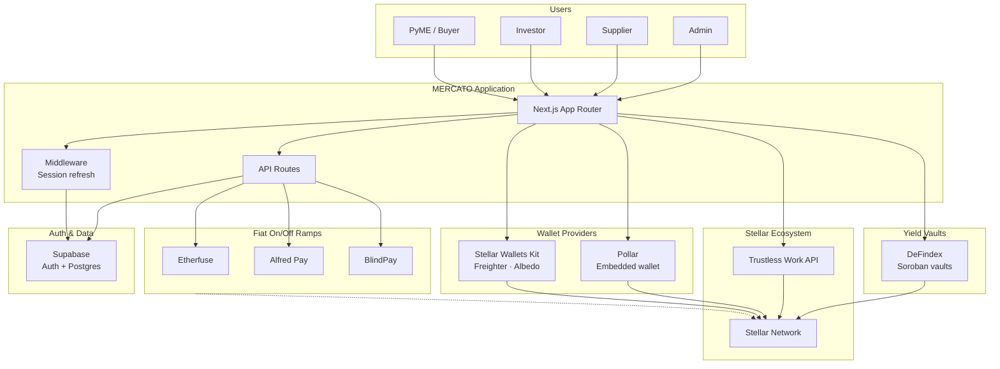

MERCATO is a web app that connects **PyMEs**, **investors**, and **suppliers** through transparent Stellar settlement. Auth and deal data live in **Supabase**; **investor funding** pays the supplier directly (plus a 1% platform fee); **repayment** uses non-custodial **Trustless Work multi-release escrow** on **Stellar**. Users connect **Stellar Wallets Kit** (Freighter, Albedo) or **Pollar** embedded wallets; TW escrow signing requires SWK. Users move fiat to/from Stellar assets via configurable **ramp providers** (Etherfuse, AlfredPay, BlindPay). **DeFindex** ([documentation](https://docs.defindex.io)) supplies **Soroban yield vaults** for investor/PyME treasury at `/dashboard/vault`, with admin monitoring at `/dashboard/admin/vault`. **Blend** testnet assets appear only as helpers for DeFindex vault trustline setup — there is no direct Blend SDK integration. An **Admin** role creates repayment escrows, releases milestones, and oversees vault operations.

---

## 2. What the Application Does

### 2.1 Core Deal Flow

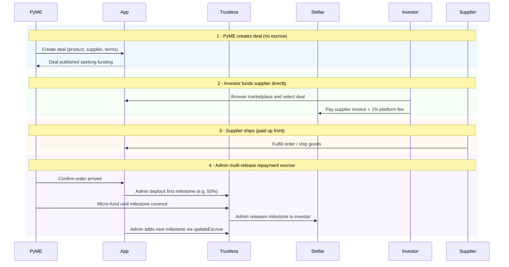

### 2.2 User Roles

| Role | Main actions |
|------|-------------|
| **PyME (Buyer)** | Create deal, choose supplier from catalog, confirm order arrival, micro-fund repayment escrow. |
| **Investor** | Browse marketplace, fund deals in USDC (direct to supplier + 1% platform fee). Receives principal + yield from repayment milestones to their Stellar address. Optional DeFindex vault for idle capital. |
| **Supplier** | Manage company profile and product catalog, fulfill orders. Receives full invoice payment up front (fee-free). |
| **Admin** | Create multi-release repayment escrows, approve/release milestones, add subsequent milestones, resolve disputes. |

### 2.3 Application Routes

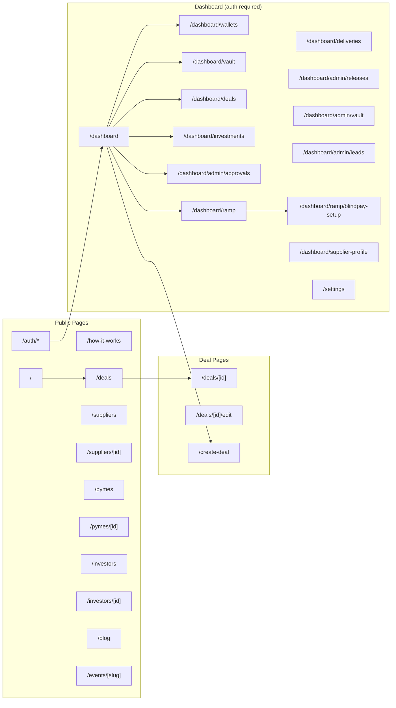

**Redirects:** `/marketplace` and `/orders` → `/deals`. `/dashboard/admin` → `/dashboard/admin/approvals`.

**Full route inventory:**

| Route | Type | Description |
|-------|------|-------------|
| `/` | Public | Landing page (hero, stakeholders, trust, CTA) |
| `/how-it-works` | Public | Step-by-step flow explanation |
| `/our-story` | Public | Company story |
| `/deals` | Public | **Marketplace** — browse and filter deals |
| `/marketplace`, `/orders` | Public | Redirect → `/deals` |
| `/create-deal` | Auth | Multi-step deal creation (DB only; no escrow at create) |
| `/deals/[id]` | Public | Deal detail (funding + repayment panels) |
| `/deals/[id]/edit` | Auth | Edit deal terms (pre-funding only) |
| `/auth/login` | Public | Supabase email login |
| `/auth/sign-up` | Public | Registration with role selection |
| `/auth/sign-up-success` | Public | Post-signup confirmation |
| `/auth/forgot-password` | Public | Password reset request |
| `/auth/update-password` | Public | Set new password |
| `/auth/callback` | API | OAuth / magic-link callback |
| `/dashboard` | Auth | Role-based overview (stats, quick actions, recent deals) |
| `/dashboard/wallets` | Auth | Connect SWK or Pollar; balances; Pollar activation |
| `/dashboard/vault` | Auth | DeFindex user vault (investor, PyME) |
| `/dashboard/admin/approvals` | Admin | Create repayment escrows for order-confirmed deals |
| `/dashboard/admin/releases` | Admin | Release funded repayment milestones |
| `/dashboard/admin/vault` | Admin | DeFindex vault monitor (TVL, strategies, rebalance) |
| `/dashboard/admin/leads` | Admin | Event lead submissions |
| `/dashboard/deals` | Auth | Supplier's deal list |
| `/dashboard/deliveries` | Auth | Supplier delivery management |
| `/dashboard/investments` | Auth | Investor portfolio view |
| `/dashboard/ramp` | Auth | Add funds / cash out (fiat ↔ USDC) |
| `/dashboard/ramp/blindpay-setup` | Auth | BlindPay onboarding wizard (ToS, KYC, wallet) |
| `/dashboard/supplier-profile` | Auth | Manage supplier companies and products |
| `/investors` | Public | Investor directory |
| `/investors/[id]` | Public | Investor public profile |
| `/pymes` | Public | PyME directory |
| `/pymes/[id]` | Public | PyME public profile |
| `/suppliers` | Public | Supplier directory |
| `/suppliers/[id]` | Public | Supplier public profile |
| `/blog`, `/blog/[slug]` | Public | Blog index and articles |
| `/events/[slug]` | Public | Event landing pages + lead capture |
| `/settings` | Auth | User profile and Stellar address |
| `/api/catalog` | API | Supplier product catalog |
| `/api/ramp/*` | API | Ramp provider proxy (14 routes) |
| `/api/defindex/*` | API | DeFindex vault (10 routes) |
| `/api/stellar/*` | API | Tx submit, SAC balance, trustline, vault activity |
| `/api/auth/pollar-sync` | API | Sync Pollar session to Supabase |
| `/api/pollar/activate` | API | Activate Pollar embedded wallet |
| `/api/reputation/*` | API | Reputation stake and refresh |
| `/api/referral/*` | API | Supplier referral program |
| `/api/leads` | API | Event lead form submissions |
| `/api/notifications/create` | API | Manual notification creation |

### 2.4 Deal and Repayment Lifecycles

MERCATO tracks **two parallel lifecycles** on each deal: `deals.status` (business progress) and `deals.repayment_status` (Trustless Work escrow). See also [AGENTS.md](../AGENTS.md#end-to-end-deal-flow-authoritative).

**Deal status (`deals.status`):**

| DB value | App `DealStatus` | Trigger |
|----------|------------------|---------|
| `seeking_funding` | `awaiting_funding` | Deal created |
| `funded` | `funded` | Investor funds supplier |
| `in_progress` | `in_progress` | Supplier ships (tracking added) |
| `completed` | `completed` | All repayment milestones released |

**Repayment status (`deals.repayment_status`):**

```
none → order_confirmed → escrow_initialized → funding → ready_to_release
     → partially_released → released
```

| Status | Meaning |
|--------|---------|
| `none` | Default at deal creation |
| `order_confirmed` | PyME confirmed delivery |
| `escrow_initialized` | Admin deployed TW multi-release escrow |
| `funding` | PyME micro-funding in progress |
| `ready_to_release` | Milestone fully funded, awaiting admin release |
| `partially_released` | At least one milestone released, more remain |
| `released` | All milestones released; deal can complete |

Investor payout address is resolved from `profiles.address` or `profiles.stellar_public_key` via `lib/deals/investor-wallet.ts`.

---

## 3. Tech Stack

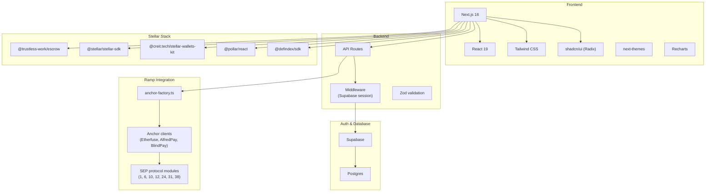

| Layer | Technology | Version |
|-------|-----------|---------|
| **Framework** | Next.js (App Router, Turbopack) | 16.1 |
| **UI** | React, Tailwind CSS, shadcn/ui (Radix primitives), Recharts | React 19.2 |
| **Theming** | next-themes (light / dark) | 0.4 |
| **Auth & DB** | Supabase (Auth, Postgres, SSR client) | 2.47 |
| **Escrow** | Trustless Work API (@trustless-work/escrow) | 3.0 |
| **Wallets** | Stellar Wallets Kit (Freighter, Albedo) + Pollar embedded | 1.9 / 0.6 |
| **Stellar** | @stellar/stellar-sdk | 14.5 |
| **Yield vaults (Soroban)** | [DeFindex](https://docs.defindex.io) (@defindex/sdk) — user vault + admin monitor | 0.3 |
| **i18n** | en/es dictionaries, locale cookie | — |
| **Validation** | Zod, react-hook-form | 3.24 / 7.54 |
| **Ramps** | Custom anchor clients + SEP modules (lib/anchors) | — |

---

## 4. Project Structure

```
mercato-dapp/
├── AGENTS.md                     # AI agent orientation (start here for agents)
├── app/                          # Next.js App Router
│   ├── layout.tsx                # Root layout (providers, fonts, theme, i18n)
│   ├── page.tsx                  # Landing page
│   ├── deals/                    # Marketplace (/deals) + [id] detail + edit
│   ├── auth/                     # Login, sign-up, password reset, callback
│   ├── create-deal/              # Multi-step deal creation
│   ├── dashboard/
│   │   ├── page.tsx              # Role-based overview
│   │   ├── wallets/              # SWK + Pollar connect, balances
│   │   ├── vault/                # DeFindex user vault
│   │   ├── admin/
│   │   │   ├── approvals/        # Create repayment escrows
│   │   │   ├── releases/         # Release funded milestones
│   │   │   ├── vault/            # DeFindex admin monitor
│   │   │   └── leads/            # Event lead submissions
│   │   ├── deals/                # Supplier deal list
│   │   ├── deliveries/           # Delivery management
│   │   ├── investments/          # Investor portfolio
│   │   ├── ramp/                 # Fiat on/off ramp + blindpay-setup
│   │   └── supplier-profile/     # Company & product management
│   ├── blog/, events/, investors/, pymes/, suppliers/
│   ├── settings/
│   └── api/
│       ├── ramp/                 # Ramp proxy (14 routes)
│       ├── defindex/             # Vault API (10 routes)
│       ├── stellar/              # Submit, SAC, trustline, vault activity
│       ├── auth/pollar-sync/     # Pollar → Supabase sync
│       └── pollar/activate/      # Pollar wallet activation
│
├── components/
│   ├── deals/                    # Funding, repayment, delivery panels
│   ├── ramp/                     # Ramp UI (provider + variant composition)
│   ├── wallet/                   # Wallet status card
│   ├── dashboard/, admin/
│   └── ui/                       # shadcn/ui primitives
│
├── lib/
│   ├── deals.ts, deals/          # Mapping, fees, investor-wallet, repayment helpers
│   ├── mercato-wallet.ts         # Unified wallet types, storage, balance parsing
│   ├── stellar/                  # USDC split payment, submit, vault trustline helpers
│   ├── trustless/                # TW config, wallet-kit, trustlines
│   ├── defindex/                 # Vault config, monitor, math, route helpers
│   ├── anchor-factory.ts, ramp-api.ts
│   ├── anchors/                  # Etherfuse, AlfredPay, BlindPay + SEP modules
│   ├── admin/, dashboard/, investments/
│   ├── i18n/                     # en/es dictionaries, locale
│   └── supabase/                 # Client, server, service, proxy
│
├── hooks/                        # use-wallet, use-repayment-escrow, use-deal-detail, useDefindex, …
├── providers/                    # wallet-provider, pollar-provider
├── middleware.ts                 # Supabase session + locale cookie
└── supabase/migrations/          # Database schema (source of truth)
```

---

## 5. Stellar, Direct Funding, and Trustless Work (Repayment Escrow)

**Funding is not escrowed.** Investors pay the supplier (principal) and Mercato (1% platform fee) with a classic Stellar USDC payment built in `lib/stellar/build-usdc-split-payment.ts`.

**Repayment is escrowed and non-custodial.** After the PyME confirms order arrival, an **admin** deploys a Trustless Work **multi-release** repayment escrow. The PyME micro-funds; the platform wallet approves and releases each milestone to the investor. Further milestones are added with `updateEscrow` so investors can receive early payouts (e.g. first 50%) without waiting for the full grossed amount.

### 5.1 Trustless Work Integration

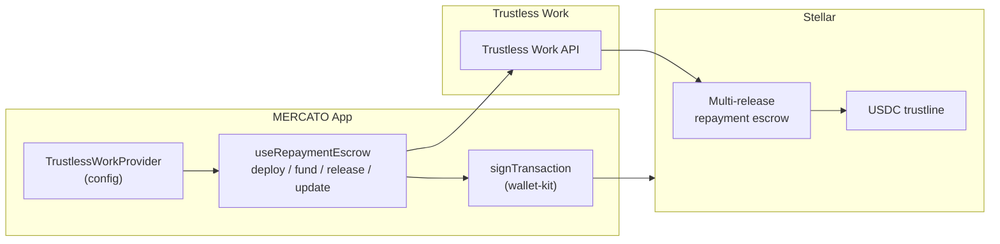

### 5.2 Escrow Configuration

| Env var | Purpose |
|---------|---------|
| `NEXT_PUBLIC_MERCATO_PLATFORM_ADDRESS` | Platform Stellar address — `approver`, `releaseSigner`, `disputeResolver`, `platformAddress`; also receives 1% at investor funding |
| `NEXT_PUBLIC_TRUSTLESSLINE_ADDRESS` | USDC trustline contract address for repayment escrow |
| `NEXT_PUBLIC_TRUSTLESS_NETWORK` | `testnet` or `mainnet` |
| `NEXT_PUBLIC_TRUSTLESS_WORK_API_KEY` | Trustless Work API key |
| `NEXT_PUBLIC_USDC_ISSUER` | Classic USDC issuer for investor→supplier direct payments |

### 5.3 Repayment Escrow Sequence

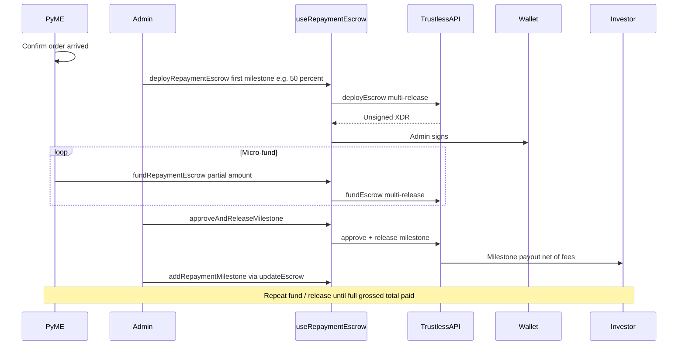

**Fee math:** PyME funds a **grossed** amount so that after platform **1%** + Trustless Work **0.3%** on release, the investor nets principal + interest. See `lib/deals/fees.ts` (`repaymentEscrowAmount`, `repaymentMilestoneAmount`).

**Repayment status lifecycle:** `none` → `order_confirmed` → `escrow_initialized` → `funding` → `ready_to_release` → `partially_released` → `released` (deal completed).

### 5.4 Wallet Providers (Stellar Wallets Kit + Pollar)

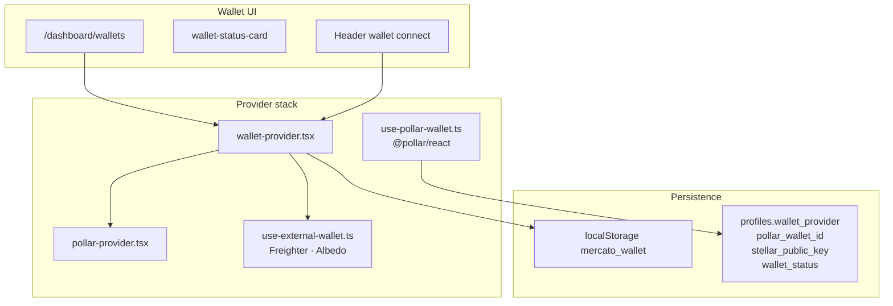

| Provider | ID | Signing | TW escrow | Deal funding |
|----------|-----|---------|-----------|--------------|
| Stellar Wallets Kit | `stellar-wallets-kit` | `signTransaction` via `lib/trustless/wallet-kit.ts` | ✅ Required | ✅ |
| Pollar embedded | `pollar` | `signAndSubmitTx` via `@pollar/react` | ❌ Shows limitation message | ✅ |

Pollar sync: `POST /api/auth/pollar-sync`. Activation: `POST /api/pollar/activate`. Limitation text: `PollarWalletKitLimitations` in `lib/mercato-wallet.ts`.

### 5.5 DeFindex Yield Vaults

DeFindex provides Soroban tokenized yield vaults for investor/PyME treasury, separate from deal escrow.

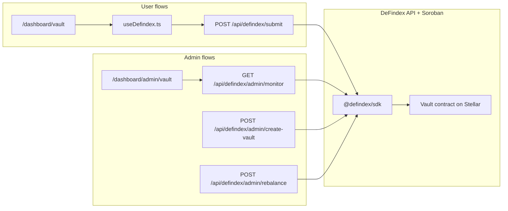

| Env var | Purpose |
|---------|---------|
| `DEFINDEX_API_KEY` | Server-only DeFindex API key |
| `NEXT_PUBLIC_DEFINDEX_VAULT_ADDRESS` | Public vault contract address |
| `MERCATO_DEFINDEX_VAULT_ADDRESS` | Server override for vault address |
| `NEXT_PUBLIC_DEFINDEX_ASSET_DECIMALS` | Asset decimals (default 7) |

User signs deposit/withdraw XDR client-side; server submits via `api/defindex/submit`. Admin can create vaults, deposit, rebalance, and monitor TVL/strategies. Blend testnet SAC helpers in `lib/stellar/vault-asset-trustline.ts` support vault asset trustline setup only.

---

## 6. Ramp Providers (Fiat On/Off)

MERCATO supports **multiple ramp providers**. Users choose one in the UI; the app proxies all anchor calls through **API routes** so API keys stay server-side.

### 6.1 Architecture

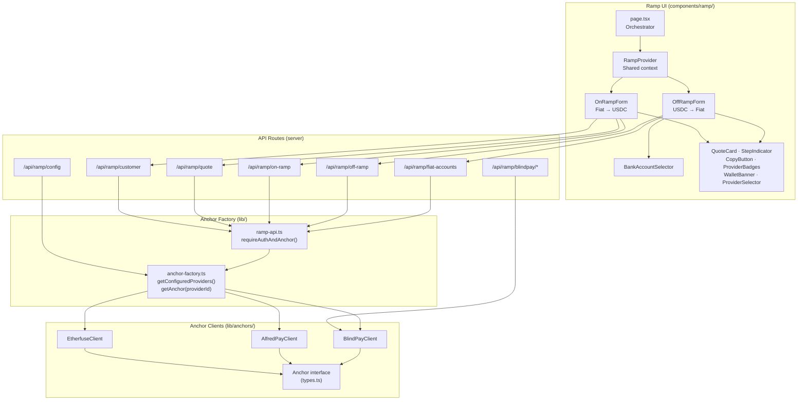

### 6.2 Ramp Component Architecture

The ramp UI follows a **provider + variant** composition pattern:

| Component | Lines | Responsibility |
|-----------|-------|---------------|
| `ramp-provider.tsx` | ~280 | Context provider — shared state (`config`, `customer`, `action`), actions (`ensureCustomer`, `fetchQuote`), and meta (`walletInfo`, `isConnected`) |
| `on-ramp-form.tsx` | ~340 | On-ramp variant — amount entry, quote review, payment instructions display |
| `off-ramp-form.tsx` | ~370 | Off-ramp variant — quote, confirm, sign & submit transaction |
| `bank-account-selector.tsx` | ~210 | Bank account CRUD with collapsible add form |
| `page.tsx` | ~120 | Thin orchestrator — layout, tabs, Suspense boundary |

Shared presentational components: `QuoteCard`, `StepIndicator`, `CopyButton`, `ProviderBadges`, `ProviderSelector`, `WalletBanner`.

### 6.3 Provider Capabilities

| Provider | Region | Fiat rail | Stellar asset | KYC flow | Off-ramp signing |
|----------|--------|-----------|---------------|----------|-----------------|
| **Etherfuse** | Mexico | SPEI | USDC, CETES | Iframe | Deferred (poll for XDR, then sign) |
| **Alfred Pay** | Latin America | SPEI | USDC | Form | Standard |
| **BlindPay** | Global | Multiple | USDB | Redirect | Anchor payout submission |

**Etherfuse, Alfred Pay, and BlindPay:** availability is driven by **environment variables**; `getConfiguredProviders()` in `anchor-factory.ts` returns only anchors with all required env vars set. All three implement the shared `Anchor` interface from `lib/anchors/types.ts`.

### 6.4 On-Ramp Data Flow

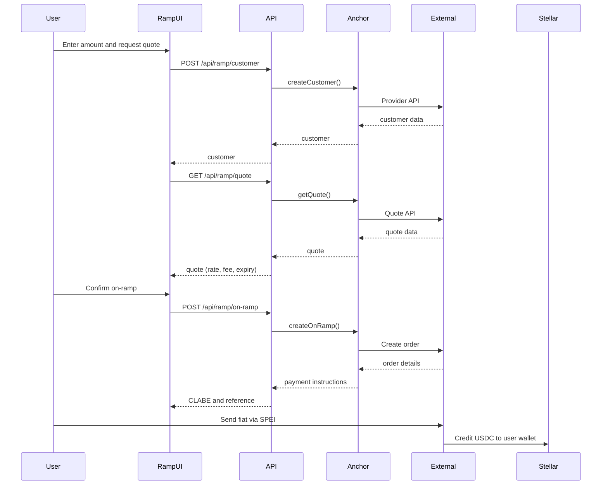

### 6.5 Off-Ramp Data Flow (with deferred signing)

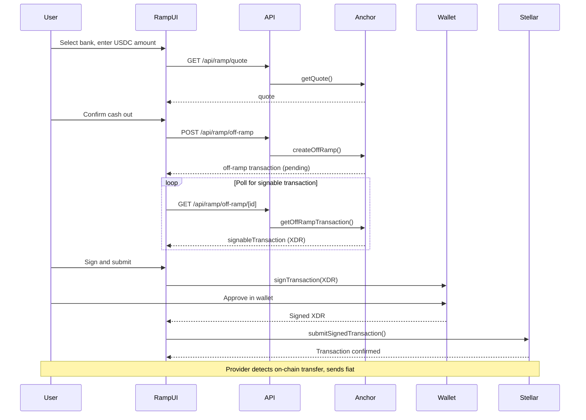

---

## 7. Data and Responsibility Split

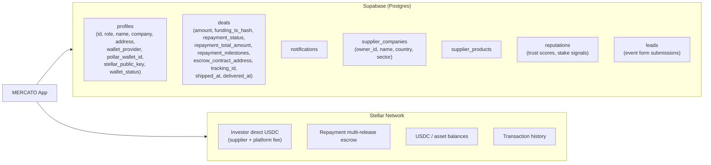

| Store | Owns | Source of truth for |
|-------|------|-------------------|
| **Supabase** | Users, profiles, roles, deal metadata, repayment status cache, supplier companies/products, reputations, leads, notifications | Who created what, funding tx hash, repayment lifecycle, supplier catalog, wallet metadata |
| **Stellar** | Direct funding payments, repayment escrow contracts, USDC balances | Funds movement, on-chain escrow milestones, payment receipts |

The app reads both stores and reconciles: `repayment_status` / `repayment_milestones` in Supabase mirror Trustless Work indexer state after fund / release / update.

### 7.1 In-App Notifications

A `notifications` table stores lifecycle events. **DB triggers** create notifications automatically for:

| Event | Recipients |
|-------|-----------|
| Deal created | All investors |
| Deal funded | Supplier (company owner), PyME |
| PyME × Investor deal created | PyME, Investor (when repayment escrow exists) |
| PyME × Investor deal complete | PyME, Investor (when repayment escrow exists) |

The bell icon in the nav shows unread count; clicking opens a dropdown with recent notifications and links to deals. Apply the tracked Supabase migrations in `supabase/migrations/` to enable.

---

## 8. Authentication and Middleware

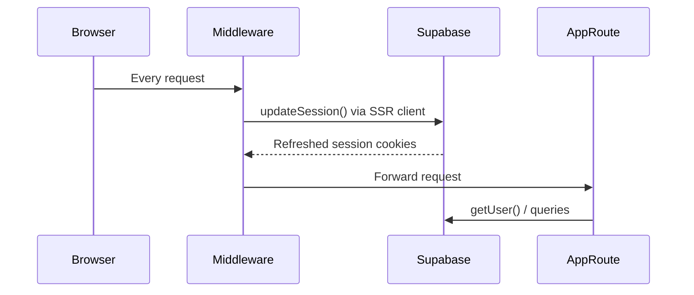

- **`middleware.ts`** runs on every request to keep the Supabase session alive (refreshes tokens via `lib/supabase/proxy.ts`).
- **Server components** use `lib/supabase/server.ts` (cookie-based SSR client).
- **API routes** use `requireAuth()` / `requireAuthAndAnchor()` from `lib/ramp-api.ts` for auth checks.
- **Client components** use `lib/supabase/client.ts` (browser client).

---

## 9. Environment Variables

| Variable | Scope | Description |
|----------|-------|-------------|
| `NEXT_PUBLIC_SUPABASE_URL` | Public | Supabase project URL |
| `NEXT_PUBLIC_SUPABASE_ANON_KEY` | Public | Supabase anon key |
| `SUPABASE_SERVICE_ROLE_KEY` | Server | Supabase service role key |
| `NEXT_PUBLIC_TRUSTLESS_WORK_API_KEY` | Public | Trustless Work API key |
| `NEXT_PUBLIC_TRUSTLESS_NETWORK` | Public | `testnet` or `mainnet` |
| `NEXT_PUBLIC_MERCATO_PLATFORM_ADDRESS` | Public | Platform Stellar address (fee recipient + repayment escrow roles) |
| `NEXT_PUBLIC_TRUSTLESSLINE_ADDRESS` | Public | USDC trustline contract address for repayment escrow |
| `NEXT_PUBLIC_USDC_ISSUER` | Public | Classic USDC issuer for direct investor→supplier payments |
| `DEFINDEX_API_KEY` | Server | DeFindex API key (never `NEXT_PUBLIC_*`) |
| `DEFINDEX_API_URL` | Server | DeFindex API base URL (optional) |
| `NEXT_PUBLIC_DEFINDEX_VAULT_ADDRESS` | Public | DeFindex vault contract address |
| `MERCATO_DEFINDEX_VAULT_ADDRESS` | Server | Server override for vault address |
| `NEXT_PUBLIC_DEFINDEX_ASSET_DECIMALS` | Public | Vault asset decimals (default 7) |
| `NEXT_PUBLIC_POLLAR_PUBLISHABLE_KEY` | Public | Pollar publishable key |
| `POLLAR_PUBLISHABLE_KEY` | Server | Duplicate for server routes (optional) |
| `POLLAR_SECRET_KEY` | Server | Pollar secret key |
| `POLLAR_WEBHOOK_SECRET` | Server | Pollar webhook signing secret |
| `NEXT_PUBLIC_POLLAR_NETWORK` | Public | `testnet` or `mainnet` for embedded wallets |
| `NEXT_PUBLIC_APP_URL` | Public | Canonical site URL (QR codes, links) |
| `ETHERFUSE_API_KEY` | Server | Etherfuse API key |
| `ETHERFUSE_BASE_URL` | Server | Etherfuse API base URL |
| `ALFREDPAY_API_KEY` | Server | AlfredPay API key |
| `ALFREDPAY_API_SECRET` | Server | AlfredPay API secret |
| `ALFREDPAY_BASE_URL` | Server | AlfredPay API base URL |
| `BLINDPAY_API_KEY` | Server | BlindPay API key |
| `BLINDPAY_INSTANCE_ID` | Server | BlindPay instance ID |
| `BLINDPAY_BASE_URL` | Server | BlindPay API base URL |

Ramp providers are **opt-in**: only those with all required env vars appear in `/api/ramp/config`. Setting zero ramp env vars disables the ramp UI gracefully.

---

## 10. Summary

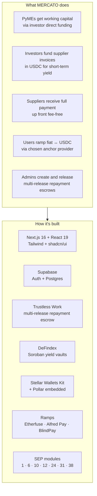

---

## References

- [Trustless Work](https://docs.trustlesswork.com/) — Escrow API and Stellar integration
- [Stellar](https://stellar.org) — Network and assets
- [Stellar Wallets Kit](https://stellarwalletskit.dev/) — Wallet connection (Freighter, Albedo)
- [Supabase](https://supabase.com) — Auth and database
- [lib/anchors/README.md](../lib/anchors/README.md) — Anchor interface and ramp provider details (Etherfuse, Alfred Pay, BlindPay)
- [AGENTS.md](../AGENTS.md) — AI-oriented index: lifecycles, routes, signing matrix, file map
- [DeFindex](https://docs.defindex.io) — Soroban yield vaults, strategies, SDKs, and operations
