# MERCATO — Architecture Documentation

**Supply chain finance, transparently secured.**

This document describes the MERCATO application architecture: what it does, which tools and Stellar-based projects it uses, and how the pieces fit together. Diagrams use [Mermaid](https://mermaid.js.org/) and render in GitHub, GitLab, and most Markdown viewers.

> **AI agents:** For a concise, machine-oriented index (lifecycles, routes, signing matrix, implementation status), start with **[AGENTS.md](../AGENTS.md)**. This document provides deeper diagrams and integration detail.

> **Architecture reviewers:** See **[Technical Architecture](technical-architecture.md)** for the current-versus-target system design, security boundaries, and the planned MoneyGram and Privy integrations.

---

## 1. High-Level System Overview

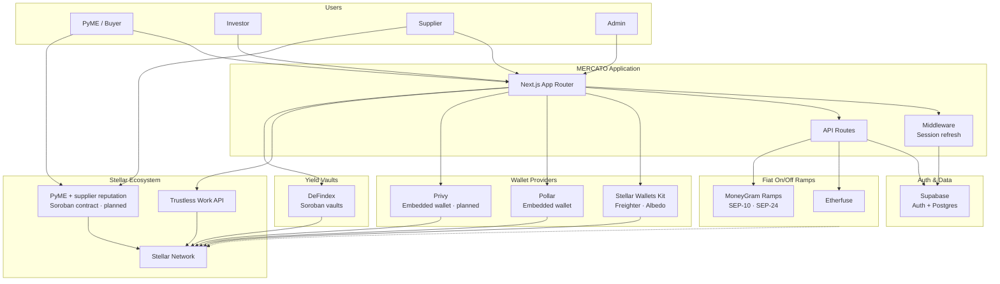

MERCATO is a web app that connects **PyMEs**, **investors**, and **suppliers** through transparent Stellar settlement. Auth and deal data live in **Supabase**. The current funding model lets one investor pay the supplier directly plus a 1% platform fee; the planned dual-investor model aggregates two proportional contributions in a funding escrow before releasing the full invoice to the supplier. **Repayment** uses non-custodial **Trustless Work multi-release escrow** on **Stellar**, with a separate per-investor milestone design for dual-investor orders. The wallet architecture supports **Stellar Wallets Kit** (Freighter, Albedo) and **Pollar**, with **Privy** planned as a third provider after Stellar signing capability validation; TW escrow signing currently requires SWK. Users move fiat to/from Stellar assets through **Etherfuse** and the planned **MoneyGram Ramps** integration. MoneyGram uses SEP-10 authentication and SEP-24 interactive USDC cash-in/cash-out. **DeFindex** ([documentation](https://docs.defindex.io)) supplies **Soroban yield vaults** at `/dashboard/vault`, with admin monitoring at `/dashboard/admin/vault`; planned supplier and PyME access is gated by role-specific on-chain reputation, based on fulfillment and repayment behavior respectively. **Blend** testnet assets appear only as helpers for DeFindex vault trustline setup — there is no direct Blend SDK integration. An **Admin** role creates repayment escrows, releases milestones, and oversees vault operations.

---

## 2. What the Application Does

### 2.1 Core Deal Flow

```mermaid
sequenceDiagram
  participant PyME
  participant App
  participant Trustless
  participant Stellar
  participant Investor
  participant Supplier

  rect rgb(240, 248, 255)
  Note over PyME,Supplier: 1 - PyME creates deal (no escrow)
  PyME->>App: Create deal (product, supplier, terms)
  App-->>PyME: Deal published seeking funding
  end

  rect rgb(245, 255, 245)
  Note over PyME,Supplier: 2 - Select single or dual-investor funding
  Investor->>App: Browse marketplace and select deal
  alt Single-investor current flow
    Investor->>Stellar: Pay supplier invoice + 1% platform fee
  else Dual-investor planned flow
    Investor->>Trustless: Contribute partial principal to funding escrow
    Note over App,Trustless: Up to two investors; show amount remaining
    Trustless->>Stellar: Release full invoice after target is reached
  end
  end

  rect rgb(255, 248, 240)
  Note over PyME,Supplier: 3 - Supplier ships (paid up front)
  Supplier->>App: Fulfill order / ship goods
  end

  rect rgb(248, 245, 255)
  Note over PyME,Supplier: 4 - Admin multi-release repayment escrow
  PyME->>App: Confirm order arrived
  App->>Trustless: Admin deploys first milestone (e.g. 50%)
  PyME->>Trustless: Micro-fund until milestone covered
  Trustless->>Stellar: Admin releases milestone to investor
  App->>Trustless: Admin adds next milestone via updateEscrow
  end
```

### 2.2 User Roles

| Role | Main actions |
|------|-------------|
| **PyME (Buyer)** | Create deals, choose suppliers, confirm arrival, and micro-fund repayment escrows. Planned: retain DeFindex access by maintaining a qualifying on-chain repayment reputation. |
| **Investor** | Browse marketplace and fund a full deal directly, or join the planned dual-investor escrow with a partial contribution. Receives contributed principal plus proportional yield from repayment milestones. Optional DeFindex vault for idle capital. |
| **Supplier** | Manage company profile and product catalog, fulfill orders, and receive the full invoice payment up front (fee-free). Planned: use DeFindex when the supplier's on-chain reputation satisfies policy. |
| **Admin** | Create multi-release repayment escrows, approve/release milestones, add subsequent milestones, resolve disputes. |

### 2.3 Application Routes

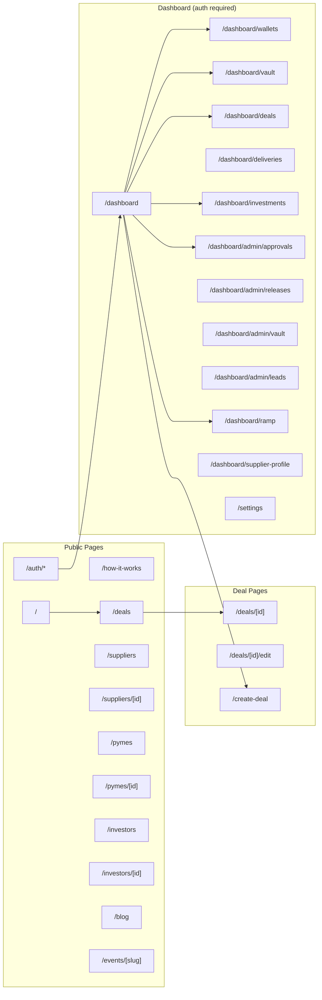

**Redirects:** `/marketplace` and `/orders` → `/deals`. `/dashboard/admin` → `/dashboard/admin/approvals`.

**Full route inventory:**

| Route | Type | Description |
|-------|------|-------------|
| `/` | Public | Landing page (hero, stakeholders, trust, CTA) |
| `/how-it-works` | Public | Step-by-step flow explanation |
| `/our-story` | Public | Company story |
| `/deals` | Public | **Marketplace** — browse and filter deals |
| `/marketplace`, `/orders` | Public | Redirect → `/deals` |
| `/create-deal` | Auth | Multi-step deal creation (DB only; no escrow at create) |
| `/deals/[id]` | Public | Deal detail (funding + repayment panels) |
| `/deals/[id]/edit` | Auth | Edit deal terms (pre-funding only) |
| `/auth/login` | Public | Supabase email login |
| `/auth/sign-up` | Public | Registration with role selection |
| `/auth/sign-up-success` | Public | Post-signup confirmation |
| `/auth/forgot-password` | Public | Password reset request |
| `/auth/update-password` | Public | Set new password |
| `/auth/callback` | API | OAuth / magic-link callback |
| `/dashboard` | Auth | Role-based overview (stats, quick actions, recent deals) |
| `/dashboard/wallets` | Auth | Connect SWK or Pollar; Privy support planned |
| `/dashboard/vault` | Auth | DeFindex user vault (investor; reputation-qualified PyMEs and suppliers in the target model) |
| `/dashboard/admin/approvals` | Admin | Create repayment escrows for order-confirmed deals |
| `/dashboard/admin/releases` | Admin | Release funded repayment milestones |
| `/dashboard/admin/vault` | Admin | DeFindex vault monitor (TVL, strategies, rebalance) |
| `/dashboard/admin/leads` | Admin | Event lead submissions |
| `/dashboard/deals` | Auth | Supplier's deal list |
| `/dashboard/deliveries` | Auth | Supplier delivery management |
| `/dashboard/investments` | Auth | Investor portfolio view |
| `/dashboard/ramp` | Auth | Add funds / cash out (fiat ↔ USDC) |
| `/dashboard/supplier-profile` | Auth | Manage supplier companies and products |
| `/investors` | Public | Investor directory |
| `/investors/[id]` | Public | Investor public profile |
| `/pymes` | Public | PyME directory |
| `/pymes/[id]` | Public | PyME public profile |
| `/suppliers` | Public | Supplier directory |
| `/suppliers/[id]` | Public | Supplier public profile |
| `/blog`, `/blog/[slug]` | Public | Blog index and articles |
| `/events/[slug]` | Public | Event landing pages + lead capture |
| `/settings` | Auth | User profile and Stellar address |
| `/api/catalog` | API | Supplier product catalog |
| `/api/ramp/*` | API | Ramp provider proxy (14 routes) |
| `/api/defindex/*` | API | DeFindex vault (10 routes) |
| `/api/stellar/*` | API | Tx submit, SAC balance, trustline, vault activity |
| `/api/auth/pollar-sync` | API | Sync Pollar session to Supabase |
| `/api/pollar/activate` | API | Activate Pollar embedded wallet |
| `/api/reputation/*` | API | Reputation stake and refresh |
| `/api/referral/*` | API | Supplier referral program |
| `/api/leads` | API | Event lead form submissions |
| `/api/notifications/create` | API | Manual notification creation |

### 2.4 Deal and Repayment Lifecycles

MERCATO tracks **two parallel lifecycles** on each deal: `deals.status` (business progress) and `deals.repayment_status` (Trustless Work escrow). See also [AGENTS.md](../AGENTS.md#end-to-end-deal-flow-authoritative).

**Deal status (`deals.status`):**

| DB value | App `DealStatus` | Trigger |
|----------|------------------|---------|
| `seeking_funding` | `awaiting_funding` | Deal created |
| `funded` | `funded` | Investor funds supplier |
| `in_progress` | `in_progress` | Supplier ships (tracking added) |
| `completed` | `completed` | All repayment milestones released |

**Repayment status (`deals.repayment_status`):**

```
none → order_confirmed → escrow_initialized → funding → ready_to_release
     → partially_released → released
```

| Status | Meaning |
|--------|---------|
| `none` | Default at deal creation |
| `order_confirmed` | PyME confirmed delivery |
| `escrow_initialized` | Admin deployed TW multi-release escrow |
| `funding` | PyME micro-funding in progress |
| `ready_to_release` | Milestone fully funded, awaiting admin release |
| `partially_released` | At least one milestone released, more remain |
| `released` | All milestones released; deal can complete |

Investor payout address is resolved from `profiles.address` or `profiles.stellar_public_key` via `lib/deals/investor-wallet.ts`.

---

## 3. Tech Stack

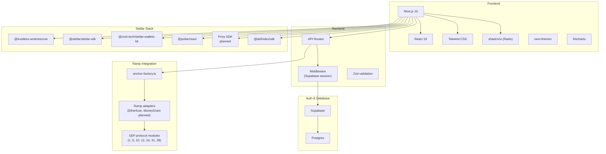

| Layer | Technology | Version |
|-------|-----------|---------|
| **Framework** | Next.js (App Router, Turbopack) | 16.1 |
| **UI** | React, Tailwind CSS, shadcn/ui (Radix primitives), Recharts | React 19.2 |
| **Theming** | next-themes (light / dark) | 0.4 |
| **Auth & DB** | Supabase (Auth, Postgres, SSR client) | 2.47 |
| **Escrow** | Trustless Work API (@trustless-work/escrow) | 3.0 |
| **Wallets** | Stellar Wallets Kit (Freighter, Albedo) + Pollar embedded + Privy embedded (planned) | 1.9 / 0.6 / TBD |
| **Stellar** | @stellar/stellar-sdk | 14.5 |
| **Yield vaults (Soroban)** | [DeFindex](https://docs.defindex.io) (@defindex/sdk) — investor vault, planned reputation-gated PyME/supplier access, admin monitor | 0.3 |
| **i18n** | en/es dictionaries, locale cookie | — |
| **Validation** | Zod, react-hook-form | 3.24 / 7.54 |
| **Ramps** | Custom anchor clients + SEP modules (lib/anchors) | — |

---

## 4. Project Structure

```
mercato-dapp/
├── AGENTS.md                     # AI agent orientation (start here for agents)
├── app/                          # Next.js App Router
│   ├── layout.tsx                # Root layout (providers, fonts, theme, i18n)
│   ├── page.tsx                  # Landing page
│   ├── deals/                    # Marketplace (/deals) + [id] detail + edit
│   ├── auth/                     # Login, sign-up, password reset, callback
│   ├── create-deal/              # Multi-step deal creation
│   ├── dashboard/
│   │   ├── page.tsx              # Role-based overview
│   │   ├── wallets/              # SWK + Pollar; Privy target integration
│   │   ├── vault/                # DeFindex user vault
│   │   ├── admin/
│   │   │   ├── approvals/        # Create repayment escrows
│   │   │   ├── releases/         # Release funded milestones
│   │   │   ├── vault/            # DeFindex admin monitor
│   │   │   └── leads/            # Event lead submissions
│   │   ├── deals/                # Supplier deal list
│   │   ├── deliveries/           # Delivery management
│   │   ├── investments/          # Investor portfolio
│   │   ├── ramp/                 # Fiat on/off ramp; MoneyGram target UI
│   │   └── supplier-profile/     # Company & product management
│   ├── blog/, events/, investors/, pymes/, suppliers/
│   ├── settings/
│   └── api/
│       ├── ramp/                 # Ramp proxy (14 routes)
│       ├── defindex/             # Vault API (10 routes)
│       ├── stellar/              # Submit, SAC, trustline, vault activity
│       ├── auth/pollar-sync/     # Pollar → Supabase sync
│       └── pollar/activate/      # Pollar wallet activation
│
├── components/
│   ├── deals/                    # Funding, repayment, delivery panels
│   ├── ramp/                     # Ramp UI (provider + variant composition)
│   ├── wallet/                   # Wallet status card
│   ├── dashboard/, admin/
│   └── ui/                       # shadcn/ui primitives
│
├── lib/
│   ├── deals.ts, deals/          # Mapping, fees, investor-wallet, repayment helpers
│   ├── mercato-wallet.ts         # Unified wallet types, storage, balance parsing
│   ├── stellar/                  # USDC split payment, submit, vault trustline helpers
│   ├── trustless/                # TW config, wallet-kit, trustlines
│   ├── defindex/                 # Vault config, monitor, math, route helpers
│   ├── anchor-factory.ts, ramp-api.ts
│   ├── anchors/                  # Etherfuse + SEP modules; MoneyGram target adapter
│   ├── admin/, dashboard/, investments/
│   ├── i18n/                     # en/es dictionaries, locale
│   └── supabase/                 # Client, server, service, proxy
│
├── hooks/                        # use-wallet, use-repayment-escrow, use-deal-detail, useDefindex, …
├── providers/                    # wallet-provider, pollar-provider; Privy target provider
├── middleware.ts                 # Supabase session + locale cookie
└── supabase/migrations/          # Database schema (source of truth)
```

---

## 5. Stellar Funding and Trustless Work Escrow Models

MERCATO supports the existing **single-investor model** and plans an optional **dual-investor model** for orders that are too large for one investor. These models have different funding and repayment escrow semantics and must remain explicit in data, UI, and transaction construction.

**Current single-investor model:** funding is not escrowed. One investor pays the supplier principal and Mercato's 1% platform fee with a classic Stellar USDC transaction built in `lib/stellar/build-usdc-split-payment.ts`.

**Planned dual-investor model:** the first investor may choose partial participation and specify a contribution below the remaining principal. A dedicated funding escrow collects contributions from at most two investors. The marketplace shows the funded and remaining amounts until the target is reached; only then can the supplier receive the full invoice amount. The original single-investor path remains available when an investor chooses to fund the entire order.

In both models, repayment is non-custodial. The single-investor repayment escrow retains its time-sliced milestones. The dual-investor repayment escrow instead creates one payout milestone per investor, with principal and profit allocated from that investor's contribution.

### 5.1 Current Single-Investor Trustless Work Integration

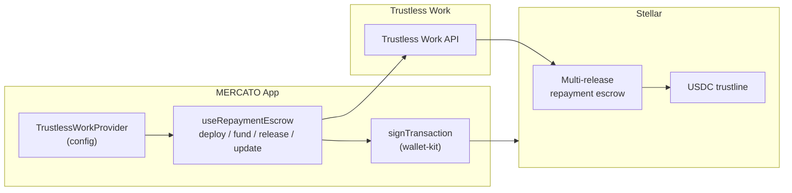

### 5.2 Escrow Configuration

| Env var | Purpose |
|---------|---------|
| `NEXT_PUBLIC_MERCATO_PLATFORM_ADDRESS` | Platform Stellar address — `approver`, `releaseSigner`, `disputeResolver`, `platformAddress`; also receives 1% at investor funding |
| `NEXT_PUBLIC_TRUSTLESSLINE_ADDRESS` | USDC trustline contract address for repayment escrow |
| `NEXT_PUBLIC_TRUSTLESS_NETWORK` | `testnet` or `mainnet` |
| `NEXT_PUBLIC_TRUSTLESS_WORK_API_KEY` | Trustless Work API key |
| `NEXT_PUBLIC_USDC_ISSUER` | Classic USDC issuer for investor→supplier direct payments |

### 5.3 Current Single-Investor Repayment Sequence

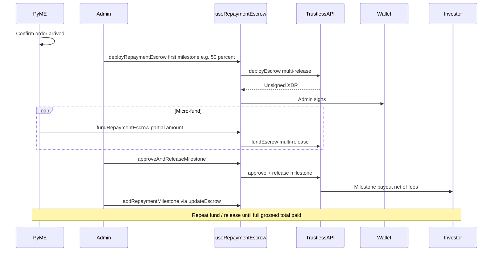

**Fee math:** PyME funds a **grossed** amount so that after platform **1%** + Trustless Work **0.3%** on release, the investor nets principal + interest. See `lib/deals/fees.ts` (`repaymentEscrowAmount`, `repaymentMilestoneAmount`).

**Repayment status lifecycle:** `none` → `order_confirmed` → `escrow_initialized` → `funding` → `ready_to_release` → `partially_released` → `released` (deal completed).

### 5.4 Planned Dual-Investor Funding Flow

Dual-investor mode is optional and capped at **two investors**. The funding UI gives the first investor an explicit choice: **Fund entire order** or **Make a partial investment**. Choosing a partial amount activates dual mode and reserves the second slot for another investor to complete the target. The deal terms—principal target, return rate, term, supplier, asset, and funding deadline—must be locked when the first contribution is accepted.

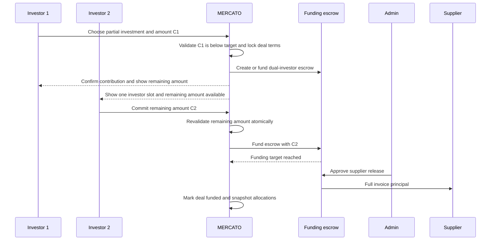

The marketplace must display `funded_amount`, `remaining_amount`, occupied investor slots, and the contribution required to complete the order. It must not expose private investor details beyond the product's approved visibility rules.

#### Funding rules

- `0 < contribution <= remaining principal`; the second investor normally fills the exact remainder.
- A single investor can still fund 100% and stay on the original direct-funding path.
- No third contribution is accepted after two investor slots are occupied.
- The supplier receives funds only after confirmed escrow balance reaches the locked principal target.
- The funding escrow is a different contract instance from the post-delivery repayment escrow. Before implementation, validate that the chosen Trustless Work escrow type supports multiple funders, target-gated supplier release, deadline cancellation, and per-investor refunds; otherwise use a purpose-built Soroban funding-pool contract.
- Platform and protocol fees must not reduce the supplier's invoice amount. If the funding escrow charges release fees, investor deposits must be grossed up or the fee must be paid separately under a documented policy.
- Contribution acceptance must use a database transaction or equivalent reservation plus ledger reconciliation so two investors cannot overfill the final slot.
- Every contribution requires an idempotency key and confirmed Stellar transaction hash before it counts toward the displayed funded total.
- If the target is not reached before the funding deadline, the escrow enters a cancellation/refund path; partial capital must never remain indefinitely locked.

Suggested funding lifecycle:

```text
open
  -> partially_funded
  -> fully_funded
  -> supplier_release_ready
  -> supplier_released

terminal alternative: expired -> refunding -> refunded
```

The existing derived `FundingStatus` is insufficient for this flow. The target schema should introduce a funding mode and contribution records rather than storing both investors in `deals.investor_id`:

| Record | Target fields |
|--------|---------------|
| `deals` | `funding_mode` (`single` or `dual`), locked target, funding deadline, funding escrow ID, aggregate funding state |
| `deal_investments` | deal ID, investor ID, committed principal, ownership share, contribution status, funding transaction hash, timestamps |
| funding escrow snapshot | contract ID, expected target, confirmed balance, release/refund transaction hashes, last reconciled ledger |

`deal_investments` becomes the source for portfolio ownership and repayment allocation. `deals.investor_id` remains a compatibility field for existing single-investor deals and must not be treated as authoritative for dual-investor orders.

### 5.5 Planned Dual-Investor Repayment Flow

Dual-investor repayment uses a **separate Trustless Work multi-release escrow** created after delivery confirmation. Unlike the current model—where milestones are time slices paid to one investor—each dual-mode milestone belongs to one investor and represents that investor's complete principal-plus-profit entitlement.

Let:

- `P` = locked supplier invoice principal.
- `Cᵢ` = confirmed principal contributed by investor `i`.
- `Sᵢ = Cᵢ / P` = investor `i`'s ownership share.
- `R` = total deal profit computed from the locked deal terms by `computeInvestorReturns`.
- `F = 1.3%` = current combined repayment release deduction: Mercato 1% + Trustless Work 0.3%.

For each investor:

```text
profit_i        = roundUSDC(R * S_i)
net_payout_i    = C_i + profit_i
gross_milestone_i = roundUSDC(net_payout_i / (1 - F))
```

The final investor's profit and gross milestone absorb any 7-decimal USDC rounding remainder so that all investor profits equal `R`, all contributed principals equal `P`, and all gross milestones equal the stored repayment target. Allocation inputs and computed outputs must be snapshotted when the order becomes fully funded; later profile or deal changes cannot alter entitlements.

Example for a `10,000 USDC` order with `1,000 USDC` total profit:

| Investor | Contribution | Share | Profit | Net repayment |
|----------|-------------:|------:|-------:|--------------:|
| Investor 1 | 6,000 | 60% | 600 | 6,600 |
| Investor 2 | 4,000 | 40% | 400 | 4,400 |
| **Total** | **10,000** | **100%** | **1,000** | **11,000** |

Gross milestone amounts are calculated from each net repayment so release deductions do not reduce either investor's principal or profit.

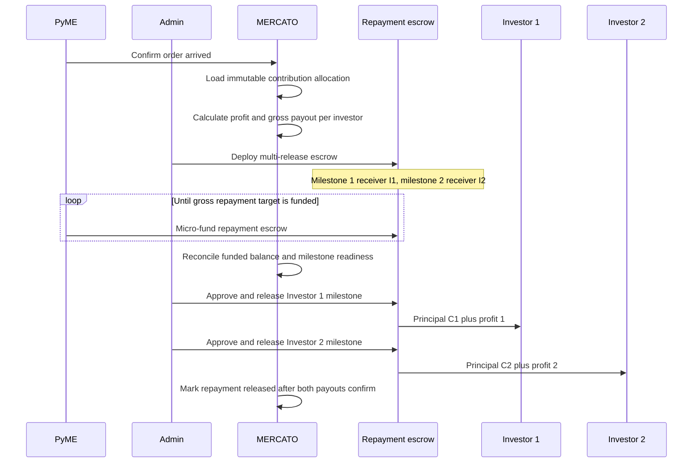

Each repayment milestone must persist the investment ID, investor wallet address captured for that investment, contributed principal, share, profit, net payout, gross amount, and release transaction hash. A milestone cannot be redirected merely because the investor later changes their default profile wallet; wallet changes require a separately authorized update before escrow funding or release.

The deal completes only after every investor milestone is confirmed released. A partial release produces a dual-mode repayment state that identifies which investor has been paid without marking the overall deal complete. Disputes, refunds, and failed releases must be handled per milestone while preserving the aggregate escrow balance and audit trail.

### 5.6 Wallet Providers (Stellar Wallets Kit + Pollar + Privy)

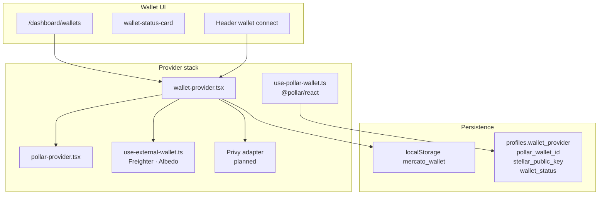

| Provider | ID | Signing | TW escrow | Deal funding |
|----------|-----|---------|-----------|--------------|
| Stellar Wallets Kit | `stellar-wallets-kit` | `signTransaction` via `lib/trustless/wallet-kit.ts` | ✅ Required | ✅ |
| Pollar embedded | `pollar` | `signAndSubmitTx` via `@pollar/react` | ❌ Shows limitation message | ✅ |
| Privy embedded (planned) | `privy` (proposed) | Capability spike required for Stellar XDR signing | ⚠️ Not validated | ⚠️ Not validated |

Pollar sync: `POST /api/auth/pollar-sync`. Activation: `POST /api/pollar/activate`. Limitation text: `PollarWalletKitLimitations` in `lib/mercato-wallet.ts`.

Privy is additive: it must not replace existing SWK or Pollar accounts. Before enabling a Privy capability, test account creation/recovery, Stellar address validation, classic transaction XDR signing, SEP-10 challenge signing, and Soroban authorization on the configured network. Persisting multiple wallets per user will require a normalized wallet record (for example, `profile_wallets`) rather than overloading the current Pollar-oriented profile columns.

### 5.7 DeFindex Yield Vaults and Reputation-Gated Access

DeFindex provides Soroban tokenized yield vaults for idle capital, separate from deal funding and repayment escrow. Investors and PyMEs use the current vault flow. In the target model, investors retain access while both **suppliers and PyMEs** qualify through role-specific on-chain reputation. Reliable fulfillment unlocks the feature for suppliers; correct repayment behavior preserves access for PyMEs.

The current `reputations` table and `/api/reputation/*` routes remain an off-chain application score. The role-specific scores described here are a new Soroban-backed model and must not be presented as implemented until the contract, event pipelines, migration policy, and access enforcement are deployed.

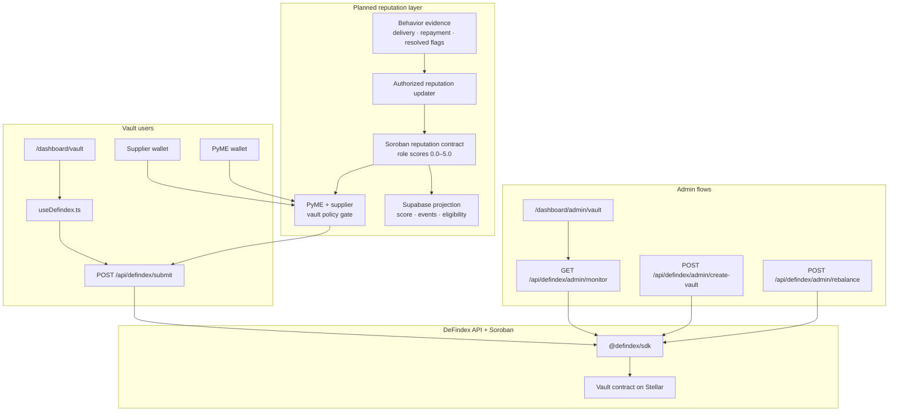

| Env var | Purpose |
|---------|---------|
| `DEFINDEX_API_KEY` | Server-only DeFindex API key |
| `NEXT_PUBLIC_DEFINDEX_VAULT_ADDRESS` | Public vault contract address |
| `MERCATO_DEFINDEX_VAULT_ADDRESS` | Server override for vault address |
| `NEXT_PUBLIC_DEFINDEX_ASSET_DECIMALS` | Asset decimals (default 7) |

Users sign deposit/withdraw XDR client-side; the server submits through `api/defindex/submit`. Admins can create vaults, deposit, rebalance, and monitor TVL/strategies. Blend testnet SAC helpers in `lib/stellar/vault-asset-trustline.ts` support vault asset trustline setup only.

#### Role-specific reputation scores

Each planned score is bounded from **0.0 to 5.0** and starts at **5.0** after the participant's identity, role, and wallet are verified. The Soroban contract stores scores as fixed-point integers (for example, `500` = `5.00`) rather than floating-point data. A supplier score represents fulfillment reliability; a PyME score represents repayment reliability. Neither is financial advice or a guarantee of future performance.

| Rule | Architecture requirement |
|------|--------------------------|
| Initial score | `5.0` for a newly verified supplier or PyME identity; initialization is idempotent |
| Supplier: late delivery | A confirmed delivery after the contractually stored deadline may apply a supplier-policy deduction |
| Supplier: product misuse or quality incident | A substantiated incident may apply a supplier-policy deduction after review |
| PyME: late repayment | Failure to fund a required repayment amount by its locked due date plus grace period may apply a PyME-policy deduction |
| PyME: incomplete repayment | A finalized shortfall, default, or unresolved missed milestone may apply a severity-based PyME-policy deduction |
| Correct repayment | Preserves the PyME score and may contribute to a transparent recovery policy; it cannot exceed `5.0` |
| User flag | Opens a case only; a flag by itself never changes the score |
| Bounds | Contract clamps the result to `0.0 <= score <= 5.0` |
| Corrections | Reversed findings use an explicit compensating event; history is never silently rewritten |
| Recovery | Any score recovery or decay policy must be transparent, versioned, and approved before launch |

Exact deduction values and eligibility thresholds are governance parameters, not hardcoded assumptions in this document. The initial policy can define separate `MIN_SUPPLIER_DEFINDEX_SCORE` and `MIN_PYME_DEFINDEX_SCORE` values. The UI shows the participant's current role score, applicable threshold, finalized deductions, and steps required to regain access.

#### Reputation contract and evidence model

```text
ParticipantReputation
  initialize_subject(subject_id_hash, role, wallet) -> score 5.0
  apply_event(subject_id_hash, role, event_id, event_type, severity, evidence_hash, policy_version)
  reverse_event(subject_id_hash, role, original_event_id, correction_event_id)
  get_score(subject_id_hash, role) -> score, policy_version, updated_ledger
  is_eligible(subject_id_hash, role, policy_id) -> bool
```

- A stable participant identity and role map to one or more authorized wallets; changing wallets must not reset reputation, and changing roles must not merge unrelated supplier and PyME scores.
- Only a governed updater role or approved oracle can apply finalized events. The updater uses objective application and ledger evidence, while the contract independently enforces authorization, bounds, event uniqueness, and policy version and derives the permitted deduction from event type and severity.
- Store only an opaque supplier identifier, event type, numeric delta, timestamp/ledger, policy version, and evidence hash on-chain. Tracking details, complaints, personal information, and review notes remain access-controlled off-chain.
- Every event ID is unique to prevent replay or duplicate penalties. Supabase indexes contract events for UI and queries, but Soroban state and events are authoritative for the score.
- Contract upgrades, updater rotation, and policy changes require multisig or timelocked governance plus an audit event.

#### Reputation event lifecycle

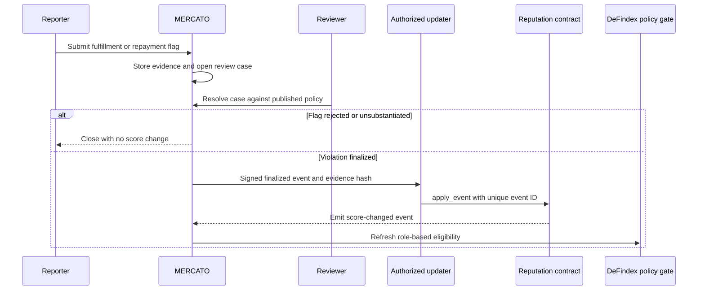

Automated supplier late-delivery evidence can propose a case from the locked promised date and confirmed delivery timestamp. It must account for approved extensions, carrier exceptions, timezone normalization, and disputed delivery records before finalization. Product misuse or quality allegations require human review and an appeal window because they are not objectively derivable from a ledger transaction alone.

PyME repayment evidence is derived from the locked repayment schedule, Trustless Work escrow funding/release state, Stellar transaction confirmations, approved extensions, and grace periods. A scheduled job may propose `late_repayment`, `missed_milestone`, or `incomplete_repayment`, but it must reconcile authoritative on-chain state before finalization. A delayed indexer, pending transaction, disputed milestone, or admin release delay must never be attributed to the PyME. One repayment failure can produce only one active penalty event per deal milestone, preventing duplicate deductions during repeated reconciliation.

#### PyME and supplier DeFindex eligibility

Before building and again before submitting a PyME or supplier deposit, MERCATO checks:

```text
required_score = role == supplier
               ? MIN_SUPPLIER_DEFINDEX_SCORE
               : MIN_PYME_DEFINDEX_SCORE

eligible = verified_participant
        && role in [supplier, pyme]
        && onchain_role_score >= required_score
        && no_unresolved_critical_restriction
        && wallet_is_authorized_for_participant
        && wallet_network_matches_vault
```

- Qualified suppliers and PyMEs may deposit their own eligible assets and withdraw their vault shares through the same non-custodial signing flow used by investors.
- Falling below the threshold disables **new deposits** and other risk-increasing actions. It must never trap funds: withdrawals and emergency exits remain available.
- Eligibility is rechecked at transaction submission to prevent a stale browser score from bypassing policy.
- If the DeFindex vault is permissionless, an application-only check can be bypassed by direct contract invocation. Enforceable reputation gating therefore requires a permissioned vault/adapter or an allowlist checked on-chain. The UI and API gate alone is only a product-access control.
- The reputation contract does not custody user funds, choose DeFindex strategies, promise yield, or use vault balances to alter reputation.
- Supplier and PyME positions remain separate from invoice payments, funding escrows, and repayment escrows. DeFindex capital cannot satisfy a repayment obligation unless the user explicitly withdraws and funds the repayment transaction.
- Because PyMEs currently have vault access, rollout requires a published activation date and migration policy. Existing PyME positions retain withdrawal access; new deposits become subject to the on-chain score only after reconciliation and user notice.

Planned persistence should add `reputation_events` and `reputation_cases` for indexed contract history, private evidence workflow, appeals, transaction hashes, and reconciliation. The existing `reputations` row may cache the latest on-chain score and eligibility, but must include contract address, network, policy version, and last reconciled ledger so cached values cannot be mistaken for authoritative state.

---

## 6. Ramp Providers (Fiat On/Off)

The target ramp architecture supports **Etherfuse** and **MoneyGram Ramps**. MoneyGram replaces the other planned providers and must be implemented as a Stellar protocol integration, not forced into Etherfuse's quote and bank-account API model. Its hosted flow uses **SEP-10** for wallet authentication and **SEP-24** for interactive USDC deposit and withdrawal; MoneyGram owns KYC, compliance, cash collection/payout, and settlement.

MoneyGram is **planned, not implemented in the current repository**. Partner allowlisting, sandbox certification, KYB, and legal agreements are launch prerequisites.

### 6.1 Target Architecture

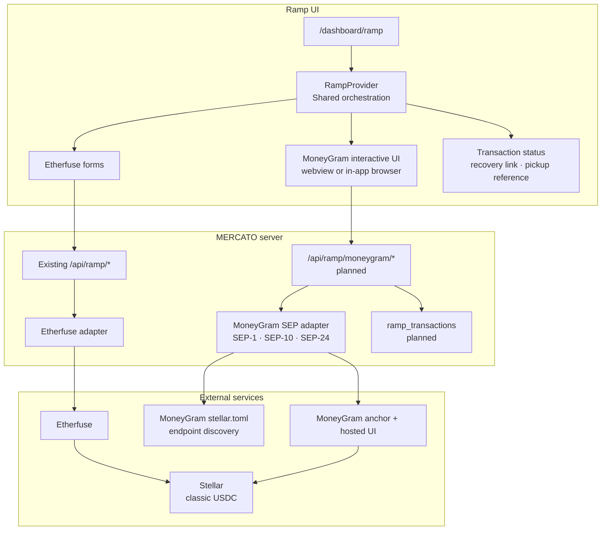

The server binds each MoneyGram transaction ID to the authenticated MERCATO user, selected wallet address, network, and on-chain transaction hash. SEP-10 JWTs must remain short-lived and server protected; raw tokens and SEP-9/KYC fields must not appear in analytics or general logs.

### 6.2 Provider Capabilities

| Provider | Availability | Fiat rail | Stellar asset | KYC flow | Settlement model |
|----------|--------------|-----------|---------------|----------|------------------|
| **Etherfuse** | Current, when configured | SPEI | USDC, CETES | Provider iframe | Existing custom adapter |
| **MoneyGram Ramps** | Planned after partner onboarding | Cash at MoneyGram agent locations | USDC | SEP-24 hosted UI | Cash-in sends USDC to the wallet; cash-out receives USDC then issues a pickup reference |

MoneyGram endpoints must be discovered from the environment's `stellar.toml` rather than hardcoded. The supplied integration guide identifies `extmgxanchor.moneygram.com` for sandbox/testnet and `mgxanchor.moneygram.com` for production. The wallet network, home domain, USDC issuer, and published signing key must agree before a transaction begins.

### 6.3 MoneyGram Authentication and Interactive Flow

1. Confirm the selected wallet is on the configured Stellar network and has a USDC trustline.
2. Discover the anchor's signing key, SEP-10 endpoint, and SEP-24 endpoint from SEP-1 (`stellar.toml`).
3. Request a SEP-10 challenge, verify the anchor signature and timebounds, have the selected wallet sign it, and exchange it for a JWT.
4. Start a SEP-24 `deposit` (cash-in) or `withdraw` (cash-out), then store the returned transaction ID.
5. Open the returned interactive URL only from a validated MoneyGram origin.
6. Treat `COMMIT_RESULT` as a notification and fetch authoritative SEP-24 status from the anchor.
7. Poll with bounded backoff until a terminal state, preserving recovery through `more_info_url`.

For a non-custodial wallet, MERCATO must provide its allowlisted client domain and publish the matching `SIGNING_KEY` in its own `stellar.toml`. Every supported wallet provider must be tested for SEP-10 challenge signing; Privy remains disabled for this flow until that capability is proven.

### 6.4 MoneyGram Cash-In (Deposit)

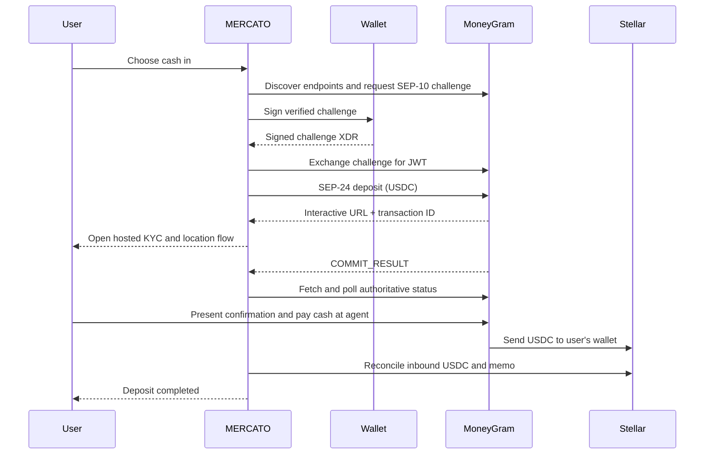

The user does not send USDC during cash-in. Their wallet must have a USDC trustline before settlement. The initial commit produces a confirmation code for the agent; `external_transaction_id` may not be available until later, so the app must continue polling.

### 6.5 MoneyGram Cash-Out (Withdrawal)

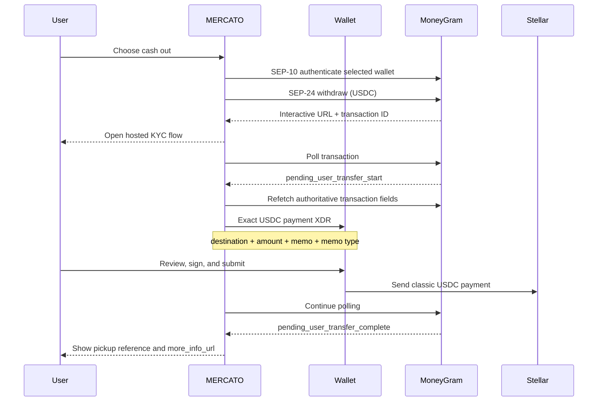

At `pending_user_transfer_start`, build the payment only from freshly fetched and validated fields: `withdraw_anchor_account`, `amount_in`, `withdraw_memo`, and `withdraw_memo_type`. The supplied guide requires the transfer to be initiated within 30 minutes. Store the intent and transaction hash idempotently before allowing retry so a timeout cannot create a duplicate cash-out payment.

### 6.6 Status, Security, and Recovery

MoneyGram status is separate from `deals.status` and `deals.repayment_status`:

```text
incomplete
  -> pending_user_transfer_start
  -> pending_user_transfer_complete
  -> pending_anchor
  -> completed

terminal alternatives: refunded, expired, error, no_market, too_small, too_large
```

- Verify `event.origin` for every `postMessage`, validate its schema, and accept only expected events such as `COMMIT_RESULT`.
- Never construct a payment from `postMessage` data; refetch the transaction from SEP-24.
- Display the complete destination, amount, USDC issuer, and memo before signing.
- Use `more_info_url` for transaction recovery and pre-pickup cash-out refunds.
- Reconcile MoneyGram status with Horizon payment data and stop polling terminal transactions.
- Exclude interactive URLs, JWTs, and KYC fields from logs, analytics, and client persistence.

---

## 7. Data and Responsibility Split

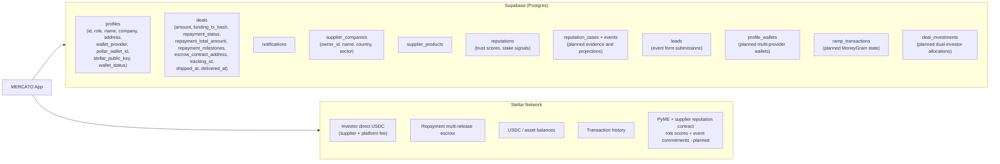

| Store | Owns | Source of truth for |
|-------|------|-------------------|
| **Supabase** | Users, profiles, roles, deal metadata, repayment status cache, supplier companies/products, reputation evidence/cases and score projections, leads, notifications; planned wallet, ramp, and investment records | Who created what, private evidence and review workflow, funding transaction hashes, investor allocations, repayment lifecycle, supplier catalog, wallet metadata, and MoneyGram transaction recovery state |
| **Stellar** | Direct funding payments, repayment escrow contracts, USDC balances, planned PyME/supplier reputation scores and event commitments | Funds movement, on-chain escrow milestones, payment receipts, and authoritative role-specific reputation state |

The app reads both stores and reconciles: `repayment_status` / `repayment_milestones` in Supabase mirror Trustless Work indexer state after fund / release / update. In the target architecture, `profile_wallets` supports SWK, Pollar, and Privy coexistence, while `ramp_transactions` caches MoneyGram state. Stellar remains authoritative for settlement and PyME/supplier reputation; the MoneyGram SEP-24 endpoint remains authoritative for ramp status.

### 7.1 In-App Notifications

A `notifications` table stores lifecycle events. **DB triggers** create notifications automatically for:

| Event | Recipients |
|-------|-----------|
| Deal created | All investors |
| Deal funded | Supplier (company owner), PyME |
| PyME × Investor deal created | PyME, Investor (when repayment escrow exists) |
| PyME × Investor deal complete | PyME, Investor (when repayment escrow exists) |

The bell icon in the nav shows unread count; clicking opens a dropdown with recent notifications and links to deals. Apply the tracked Supabase migrations in `supabase/migrations/` to enable.

---

## 8. Authentication and Middleware

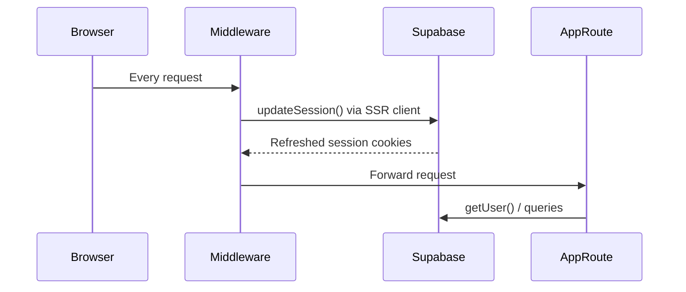

- **`middleware.ts`** runs on every request to keep the Supabase session alive (refreshes tokens via `lib/supabase/proxy.ts`).
- **Server components** use `lib/supabase/server.ts` (cookie-based SSR client).
- **API routes** use `requireAuth()` / `requireAuthAndAnchor()` from `lib/ramp-api.ts` for auth checks.
- **Client components** use `lib/supabase/client.ts` (browser client).

---

## 9. Environment Variables

| Variable | Scope | Description |
|----------|-------|-------------|
| `NEXT_PUBLIC_SUPABASE_URL` | Public | Supabase project URL |
| `NEXT_PUBLIC_SUPABASE_ANON_KEY` | Public | Supabase anon key |
| `SUPABASE_SERVICE_ROLE_KEY` | Server | Supabase service role key |
| `NEXT_PUBLIC_TRUSTLESS_WORK_API_KEY` | Public | Trustless Work API key |
| `NEXT_PUBLIC_TRUSTLESS_NETWORK` | Public | `testnet` or `mainnet` |
| `NEXT_PUBLIC_MERCATO_PLATFORM_ADDRESS` | Public | Platform Stellar address (fee recipient + repayment escrow roles) |
| `NEXT_PUBLIC_TRUSTLESSLINE_ADDRESS` | Public | USDC trustline contract address for repayment escrow |
| `NEXT_PUBLIC_USDC_ISSUER` | Public | Classic USDC issuer for direct investor→supplier payments |
| `DEFINDEX_API_KEY` | Server | DeFindex API key (never `NEXT_PUBLIC_*`) |
| `DEFINDEX_API_URL` | Server | DeFindex API base URL (optional) |
| `NEXT_PUBLIC_DEFINDEX_VAULT_ADDRESS` | Public | DeFindex vault contract address |
| `MERCATO_DEFINDEX_VAULT_ADDRESS` | Server | Server override for vault address |
| `NEXT_PUBLIC_DEFINDEX_ASSET_DECIMALS` | Public | Vault asset decimals (default 7) |
| Reputation contract address | Public/server | Planned PyME/supplier Soroban contract; both scopes must resolve the same network address |
| PyME and supplier DeFindex minimum scores | Server policy | Planned role-specific eligibility thresholds; must match the active on-chain policy |
| Reputation updater credentials | Managed signer/KMS | Planned authorized event publisher; never exposed to the browser |
| `NEXT_PUBLIC_POLLAR_PUBLISHABLE_KEY` | Public | Pollar publishable key |
| `POLLAR_PUBLISHABLE_KEY` | Server | Duplicate for server routes (optional) |
| `POLLAR_SECRET_KEY` | Server | Pollar secret key |
| `POLLAR_WEBHOOK_SECRET` | Server | Pollar webhook signing secret |
| `NEXT_PUBLIC_POLLAR_NETWORK` | Public | `testnet` or `mainnet` for embedded wallets |
| Privy app/client identifier | Public where required | Planned; exact name follows the capability spike |
| Privy app secret / webhook secret | Server | Planned; never expose through `NEXT_PUBLIC_*` |
| `NEXT_PUBLIC_APP_URL` | Public | Canonical site URL (QR codes, links) |
| `ETHERFUSE_API_KEY` | Server | Etherfuse API key |
| `ETHERFUSE_BASE_URL` | Server | Etherfuse API base URL |
| MoneyGram home domain | Server-controlled config | Planned; sandbox or production SEP-1 discovery domain |
| MoneyGram enabled flag | Server-controlled config | Planned; expose availability only after onboarding checks pass |
| SEP-10 client-domain signing secret | Server/KMS | Planned; corresponds to the public key in MERCATO's `stellar.toml` |

Etherfuse remains opt-in through its server credentials. MoneyGram availability depends on an allowlisted domain, a coherent network configuration, published client-domain signing metadata, and completed partner onboarding; SEP-10/SEP-24 do not imply a public MoneyGram API key. Exact Privy and MoneyGram variable names should be finalized during implementation rather than invented in advance.

---

## 10. Summary

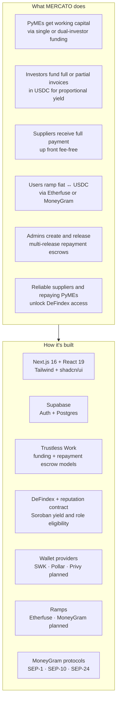

---

## References

- [Trustless Work](https://docs.trustlesswork.com/) — Escrow API and Stellar integration
- [Stellar](https://stellar.org) — Network and assets
- [Stellar Wallets Kit](https://stellarwalletskit.dev/) — Wallet connection (Freighter, Albedo)
- [MoneyGram Ramps on Stellar](https://developers.stellar.org/docs/tools/ramps/moneygram) — SEP-10/SEP-24 cash-in and cash-out overview
- [SEP-10](https://github.com/stellar/stellar-protocol/blob/master/ecosystem/sep-0010.md) and [SEP-24](https://github.com/stellar/stellar-protocol/blob/master/ecosystem/sep-0024.md) — Authentication and hosted deposit/withdrawal standards
- [Privy](https://docs.privy.io/) — Planned embedded-wallet provider; Stellar signing capabilities require validation
- [Supabase](https://supabase.com) — Auth and database
- [lib/anchors/README.md](../lib/anchors/README.md) — Current custom anchor interface and Etherfuse details
- [AGENTS.md](../AGENTS.md) — AI-oriented index: lifecycles, routes, signing matrix, file map
- [DeFindex](https://docs.defindex.io) — Soroban yield vaults, strategies, SDKs, and operations
