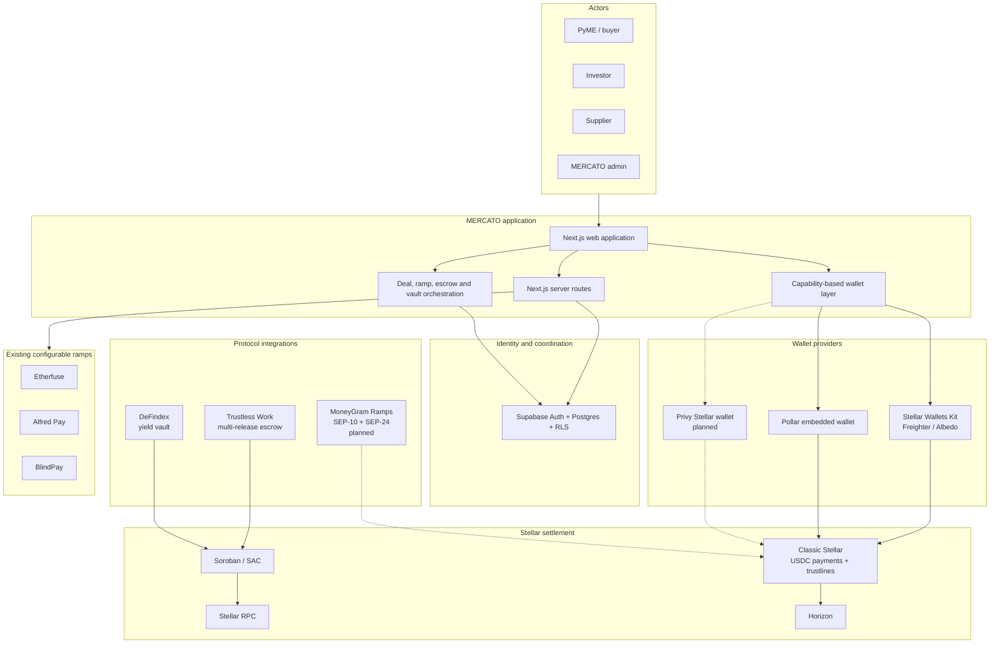
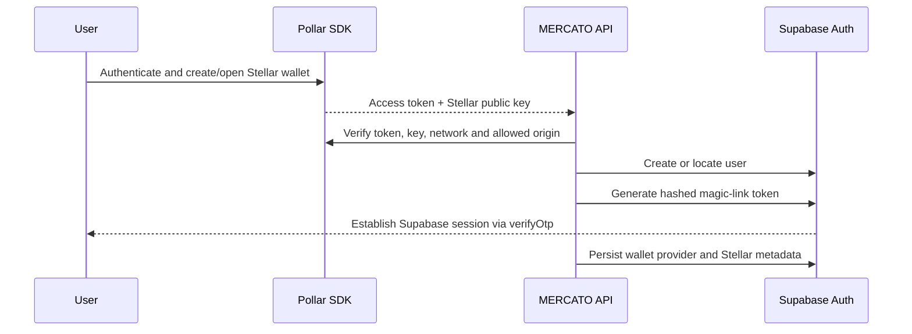
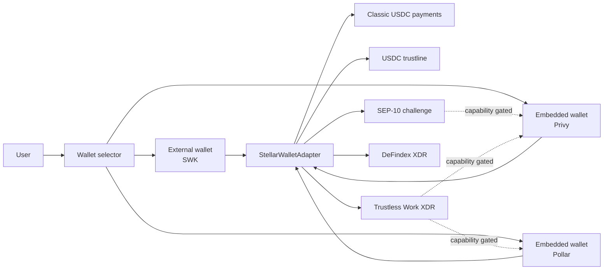
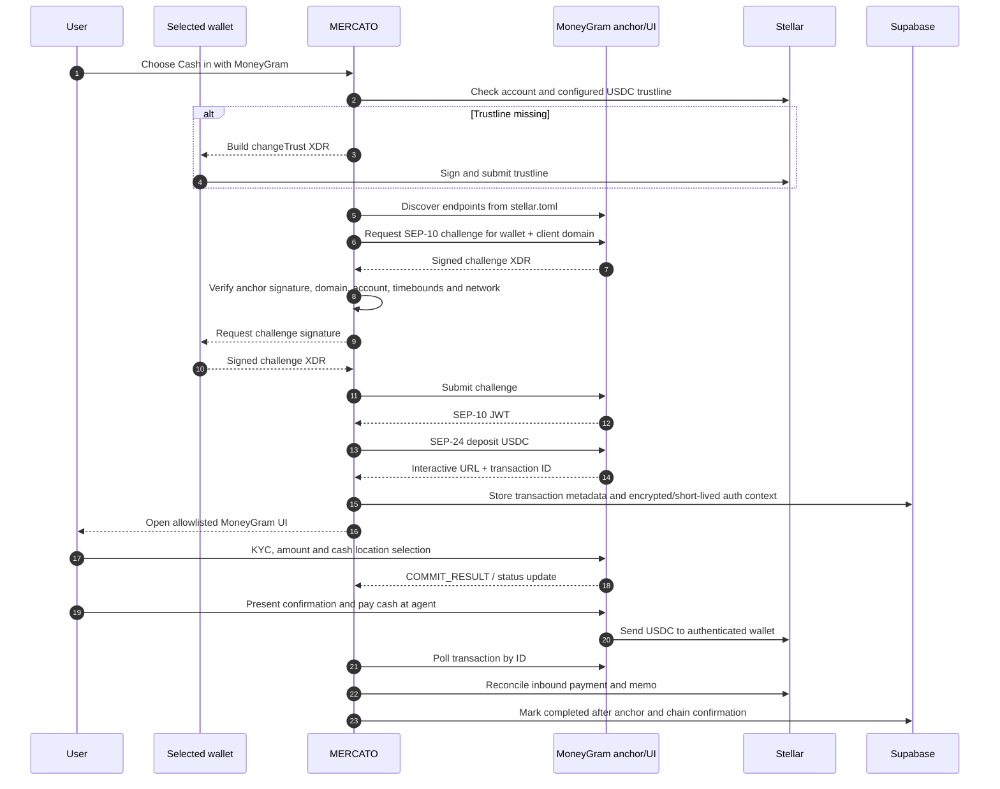
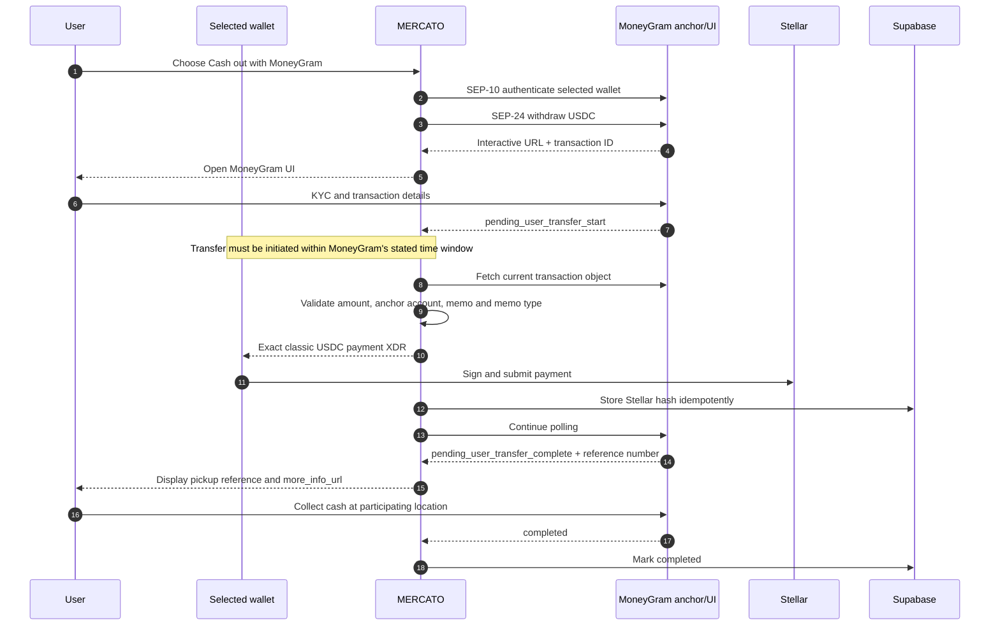
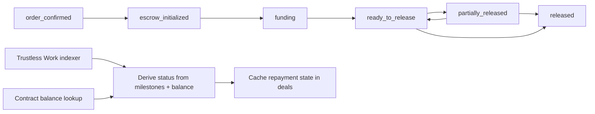
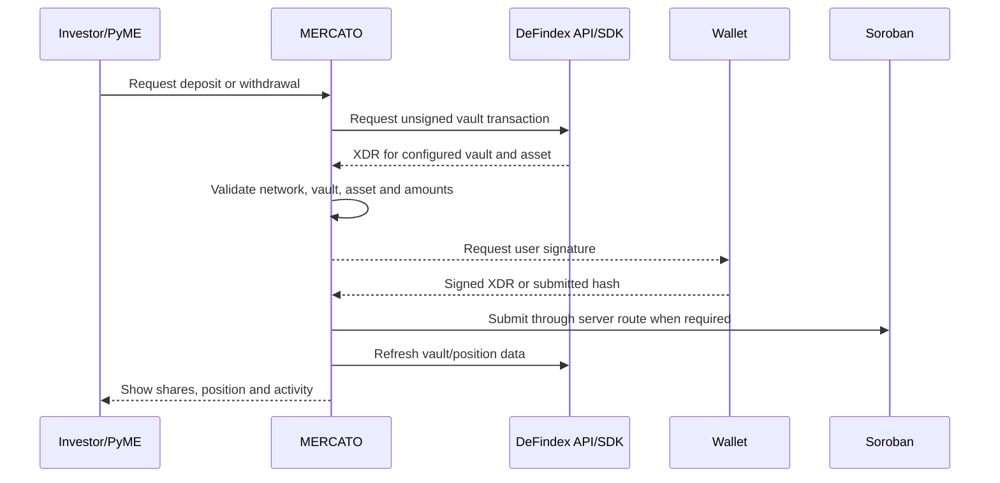
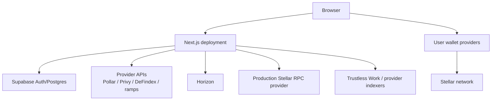

# MERCATO Technical Architecture

**Document status:** Proposed target architecture with current-state inventory  
**Audience:** Stellar, Soroban, wallet, anchor, security, and fintech reviewers  
**Last updated:** 2026-08-11  
**Primary network:** Stellar Testnet; Mainnet is a controlled deployment target  
**Repository:** `mercato-dapp` (Next.js monolith)

## 1. Purpose and scope

MERCATO is a supply-chain finance platform in which small and medium businesses (PyMEs) obtain inventory using investor capital. Investors fund verified purchase orders, suppliers are paid up front, and PyMEs repay investors through milestone-based escrow.

This document separates:

- **Current:** implemented and wired in this repository.
- **Planned:** approved architectural direction that is not yet implemented.
- **Conditional:** dependent on vendor capability validation, allowlisting, certification, or production configuration.

The target architecture adds two capabilities without replacing the current system:

1. **MoneyGram Ramps** as a Stellar-native USDC cash-in/cash-out provider using SEP-1, SEP-10, and SEP-24.
2. **Privy Stellar wallets** as an additional embedded-wallet option that coexists with Pollar and Stellar Wallets Kit behind a capability-based wallet abstraction.

MERCATO does not custody user funds. Classic Stellar payments, Trustless Work escrows, DeFindex vaults, and MoneyGram anchor transactions remain distinct settlement domains.

## 2. Architectural principles

1. **Stellar is the settlement layer.** Supabase coordinates application state but is not the source of truth for confirmed on-chain transfers.
2. **Prefer standard Stellar Assets.** Deal funding and MoneyGram use classic Stellar USDC. Soroban integrations consume the corresponding Stellar Asset Contract (SAC) where required.
3. **Keep signing user-controlled.** The server builds or obtains unsigned transactions; an authorized wallet signs. Server-side signing is not assumed for user wallets.
4. **Select wallets by capability, not brand.** A connected wallet must declare whether it can sign classic XDR, Soroban XDR, SEP-10 challenges, and sign-and-submit flows.
5. **Discover anchor configuration.** MoneyGram endpoints and signing keys are read from `stellar.toml`; they are not permanently hardcoded.
6. **Separate business state from settlement state.** A deal status, repayment escrow status, ramp transaction status, and vault transaction status are separate state machines.
7. **Make target-state claims explicit.** Planned Privy and MoneyGram paths are not presented as production capabilities until their validation gates pass.
8. **Fail closed on network or asset mismatch.** Testnet/mainnet passphrases, USDC issuers, SAC addresses, wallets, and vendor environments must agree.

## 3. System context



## 4. Current implementation inventory

| Domain | Status | Implementation |
|---|---|---|
| Web application | Current | Next.js App Router, React, TypeScript, Tailwind, Radix/shadcn |
| Authentication and database | Current | Supabase Auth, Postgres, RLS, middleware session refresh |
| External wallets | Current | Stellar Wallets Kit; Freighter and Albedo exposed through `hooks/use-external-wallet.ts` |
| Embedded wallets | Current | Pollar via `providers/pollar-provider.tsx` and `hooks/use-pollar-wallet.ts` |
| Unified wallet state | Current | `providers/wallet-provider.tsx`, `hooks/use-wallet.ts`, `lib/mercato-wallet.ts` |
| Deal funding | Current | Atomic classic Stellar transaction: supplier principal + 1% platform fee |
| Repayment | Current | Trustless Work multi-release Soroban escrow |
| Yield | Current | DeFindex vault deposit, withdraw, balance, creation, monitoring, rebalance |
| Fiat ramps | Current, opt-in | Etherfuse, Alfred Pay, and BlindPay through server-side provider routes |
| SEP client library | Current | SEP-1, 6, 10, 12, 24, 31, and 38 under `lib/anchors/sep/` |
| MoneyGram | Planned | SEP-10/SEP-24 integration, partner allowlisting, sandbox certification |
| Privy Stellar wallet | Planned/conditional | Additive embedded wallet provider; exact Stellar XDR signing flow must pass a capability spike |
| Direct Blend integration | Not implemented | Only testnet SAC/trustline helpers used during DeFindex setup |

### 4.1 Runtime stack

| Layer | Technology |
|---|---|
| Framework | Next.js 16, React 19 |
| Persistence | Supabase Postgres |
| Stellar SDK | `@stellar/stellar-sdk` |
| External wallets | `@creit.tech/stellar-wallets-kit` |
| Embedded wallet | `@pollar/react` |
| Escrow | `@trustless-work/escrow` |
| Vault | `@defindex/sdk` |
| Validation | Zod and route-level validation |
| Package manager | Bun |

### 4.2 Trust boundaries

| Boundary | Trusted responsibility | Data that must still be verified |
|---|---|---|
| Browser ↔ MERCATO API | Supabase session identifies the caller | Role, request schema, wallet ownership, amounts |
| MERCATO ↔ wallet provider | Provider returns the intended address/signature | Network, address, signed XDR contents, transaction hash |
| MERCATO ↔ MoneyGram | Anchor owns KYC and cash settlement | SEP-10 challenge, anchor signature, interactive URL origin, transaction status |
| MERCATO ↔ Trustless Work | API builds/indexes escrow operations | Contract ID, role addresses, milestone receiver, indexed balance and release state |
| MERCATO ↔ DeFindex | API/SDK builds and reports vault operations | Vault contract, asset/SAC, network, share and amount precision |
| MERCATO ↔ Supabase | RLS and service routes coordinate application state | On-chain confirmation remains authoritative for settlement |

## 5. Business and settlement model

### 5.1 Authoritative deal lifecycle

```mermaid
sequenceDiagram
  autonumber
  participant B as PyME
  participant M as MERCATO
  participant I as Investor wallet
  participant S as Supplier wallet
  participant A as Admin wallet
  participant TW as Trustless Work
  participant X as Stellar

  B->>M: Create deal
  Note over M: Supabase only; no escrow exists
  I->>M: Select and fund deal
  M-->>I: Unsigned classic USDC split-payment XDR
  I->>X: Sign and submit atomically
  X->>S: Principal in USDC
  X->>M: 1% platform fee in USDC
  M->>M: Mark deal funded after confirmation
  S->>M: Add shipping and tracking
  B->>M: Confirm delivery
  A->>TW: Deploy multi-release repayment escrow
  B->>TW: Micro-fund grossed repayment
  A->>TW: Approve and release milestones
  TW->>I: Principal + yield, net of configured fees
  M->>M: Complete after all milestones are released
```

There is deliberately **no purchase-order escrow at deal creation** and **no platform custody of supplier funding**. Investor funding is a two-operation atomic classic Stellar transaction built by `lib/stellar/build-usdc-split-payment.ts`.

### 5.2 Fee model

| Flow | Payer | Calculation | Receiver |
|---|---|---|---|
| Supplier principal | Investor | Invoice principal | Supplier |
| Funding platform fee | Investor | 1% of principal | MERCATO platform address |
| Repayment amount | PyME | Grossed so investor nets principal + yield | Trustless Work escrow |
| Repayment platform fee | Escrow release | 1% of grossed amount | Platform role/address |
| Trustless Work fee | Escrow release | 0.3% of grossed amount | Protocol |

The repayment gross-up is implemented in `lib/deals/fees.ts`:

```text
investor_target = principal + interest
grossed_repayment = investor_target / (1 - (1% + 0.3%))
```

All USDC UI calculations are rounded through the shared USDC normalization path. On-chain DeFindex amounts use configured asset decimals, normally seven on Stellar.

## 6. Wallet architecture: current and target

### 6.1 Current model

`WalletProvider` exposes one active wallet at a time:

- `stellar-wallets-kit`: external, non-embedded wallet.
- `pollar`: embedded wallet linked to a Supabase profile.

The persisted record contains provider, Stellar public key, wallet ID, embedded status, activation status, and display name. Balances come from Pollar when available or from Horizon for external wallets.

Pollar authentication is bridged to Supabase as follows:



Pollar can sign and submit simple Stellar transactions through its SDK. The repository contains Pollar branches in some Trustless Work operations; however, production support for every Soroban/admin action is not treated as guaranteed. The existing `PollarWalletKitLimitations` guard remains authoritative until end-to-end tests prove otherwise.

### 6.2 Target provider-neutral contract

Privy must be added as a third provider, not as a replacement for Pollar. The existing union expands from:

```text
'stellar-wallets-kit' | 'pollar'
```

to:

```text
'stellar-wallets-kit' | 'pollar' | 'privy'
```

The adapter contract should expose explicit capabilities:

```typescript
type StellarWalletCapabilities = {
  signClassicXdr: boolean
  signSorobanXdr: boolean
  signSep10Challenge: boolean
  submitSignedXdr: boolean
  signAndSubmitXdr: boolean
  supportsTrustline: boolean
  supportsNetworkSwitch: boolean
}

type StellarWalletAdapter = {
  provider: 'stellar-wallets-kit' | 'pollar' | 'privy'
  publicKey: string
  network: 'testnet' | 'mainnet'
  capabilities: StellarWalletCapabilities
  signXdr?: (xdr: string, passphrase: string) => Promise<string>
  submitXdr?: (signedXdr: string) => Promise<string>
  signAndSubmitXdr?: (xdr: string, passphrase: string) => Promise<string>
  disconnect: () => Promise<void>
}
```

Feature code must call a capability guard before presenting an action. It must never infer Soroban or SEP-10 support merely from `canSignTransactions: true`.

### 6.3 Pollar and Privy coexistence



Coexistence rules:

1. Existing Pollar users retain their wallet and `profiles.stellar_public_key`.
2. No automatic asset migration occurs when a user enables Privy.
3. A profile may have multiple wallet connections, but one wallet is selected for a specific action.
4. The funded investor address is immutable for that deal unless a separately authorized migration procedure is introduced.
5. Repayment always targets the address recorded for the funded investment, not whichever wallet is currently selected.
6. The MoneyGram destination/withdrawal account must be the exact wallet authenticated in SEP-10 for that transaction.
7. Provider-specific IDs must not be overloaded into the public Stellar address field.

### 6.4 Privy integration plan and validation gate

Privy documents Stellar as a supported **Tier 2 wallet-abstraction chain** and its wallet creation APIs accept `chain_type: "stellar"`. The integration must validate the exact production SDK/API method for signing Stellar transaction envelopes before implementation is considered complete.

The Privy capability spike must prove, on Stellar Testnet:

1. Create or recover a user-owned Stellar wallet.
2. Return a valid `G...` account address.
3. Sign a classic payment XDR without altering its operations.
4. Sign a `changeTrust` XDR for the configured USDC issuer.
5. Sign a SEP-10 challenge envelope with the expected network passphrase and client domain.
6. Sign a simulated/assembled Soroban transaction used by Trustless Work or DeFindex.
7. Submit the signed envelope and reconcile its hash through Horizon or RPC.
8. Preserve user authorization and recovery semantics without exposing private keys to MERCATO.

If any test fails, Privy remains available only for the capabilities that pass; SWK and Pollar continue serving the other operations. Server-initiated Privy signers are out of initial scope because they change the custody and authorization threat model.

### 6.5 Proposed wallet persistence

The current single-provider columns remain for compatibility, but a normalized table is recommended:

```text
profile_wallets
  id uuid primary key
  profile_id uuid references profiles(id)
  provider text check in ('stellar-wallets-kit', 'pollar', 'privy')
  provider_wallet_id text null
  stellar_public_key text not null
  network text check in ('testnet', 'mainnet')
  status text check in ('pending', 'active', 'disabled')
  capabilities jsonb not null
  is_default boolean not null default false
  created_at timestamptz
  updated_at timestamptz
```

A unique constraint on `(provider, provider_wallet_id, network)` and a partial unique constraint for one default wallet per profile prevent ambiguous routing.

## 7. MoneyGram Ramps target architecture

### 7.1 Protocol choice

MoneyGram is a Stellar anchor integration, not a generic REST ramp provider:

- **SEP-1:** service discovery through `/.well-known/stellar.toml`.
- **SEP-10:** Stellar Web Authentication and JWT issuance.
- **SEP-24:** hosted interactive deposit and withdrawal.
- **SEP-9 fields:** optional KYC prefill passed to the interactive flow.

The existing modules in `lib/anchors/sep/` should be reused and extended. A `moneygram` adapter should compose those modules similarly to `lib/anchors/testanchor/client.ts`, while preserving MoneyGram-specific status behavior and UI events.

### 7.2 Environment discovery

| Environment | Home domain from supplied MoneyGram guide |
|---|---|
| Sandbox/Testnet | `extmgxanchor.moneygram.com` |
| Production/Mainnet | `mgxanchor.moneygram.com` |

The attachment also contains older `extstellar.moneygram.com` metadata. MERCATO will not depend on that legacy value. For every session, it will fetch `stellar.toml`, validate HTTPS and the expected allowlisted host, then derive `WEB_AUTH_ENDPOINT`, `TRANSFER_SERVER_SEP0024`, and `SIGNING_KEY`.

### 7.3 Non-custodial classification

MERCATO will integrate as a **non-custodial wallet application**:

- Each user controls an individual Stellar account.
- MERCATO sends the wallet's home/client domain during SEP-10 where required.
- MERCATO hosts `/.well-known/stellar.toml` with its client-domain signing key.
- The user wallet signs the SEP-10 challenge.
- MoneyGram handles end-user KYC, compliance, cash acceptance/payout, and anchor settlement.
- MERCATO never receives a user secret key or cash.

MoneyGram partner onboarding, domain allowlisting, sandbox certification, KYB, legal agreements, and production key registration are external launch gates.

### 7.4 Cash-in flow: cash to Stellar USDC



Cash-in requirements:

- The destination account must have the correct USDC trustline.
- The user must preselect a supported cash-in location.
- `external_transaction_id` may not exist at initial commit; the system continues polling.
- Completion requires both an anchor terminal status and an observed/matched inbound payment where available.

### 7.5 Cash-out flow: Stellar USDC to cash



The outbound transaction is built only from the latest SEP-24 response:

- Destination: `withdraw_anchor_account`
- Amount: `amount_in`
- Memo: `withdraw_memo`
- Memo type: `withdraw_memo_type`
- Asset: USDC code plus the issuer discovered/validated for the active network

The UI must display the full destination, amount, asset issuer, and memo before signing. Retrying must never create a second payment after a transaction hash has been recorded.

### 7.6 MoneyGram status model

MoneyGram status must not be stored in `deals.status` or `deals.repayment_status`.

```text
incomplete
  -> pending_user_transfer_start
  -> pending_user_transfer_complete
  -> pending_anchor
  -> completed

terminal alternatives:
  refunded | expired | error | no_market | too_small | too_large
```

Recommended table:

```text
ramp_transactions
  id uuid primary key
  profile_id uuid references profiles(id)
  provider text
  direction text check in ('deposit', 'withdrawal')
  network text
  wallet_id uuid null references profile_wallets(id)
  stellar_public_key text not null
  anchor_transaction_id text not null
  status text not null
  asset_code text not null
  asset_issuer text not null
  amount_in numeric null
  amount_out numeric null
  memo text null
  memo_type text null
  stellar_transaction_id text null
  external_transaction_id text null
  more_info_url text null
  expires_at timestamptz null
  status_payload jsonb
  created_at timestamptz
  updated_at timestamptz
```

Do not persist raw SEP-10 JWTs in plaintext. Prefer a server-side encrypted store with expiration, or require reauthentication when the process resumes after token expiry.

### 7.7 Browser integration security

The MoneyGram interactive page may communicate through `postMessage`. MERCATO must:

1. Verify `event.origin` against the exact interactive URL origin returned by the validated anchor.
2. Validate the message schema and accept only expected event types such as `COMMIT_RESULT`.
3. Treat the posted transaction as a notification, then fetch authoritative status from SEP-24.
4. Never build a withdrawal from unverified `postMessage` fields.
5. Use `noopener`, restrictive iframe permissions, and a compatible Content Security Policy.
6. Avoid placing SEP-10 JWTs, secrets, or sensitive KYC values in query logs or analytics.

### 7.8 Integration with the existing ramp UI

The current custom `Anchor` interface assumes customer, quote, bank account, and payout concepts that do not map cleanly to SEP-24. MoneyGram should therefore use a protocol-specific adapter behind a higher-level ramp orchestrator:

```text
RampProvider
  CustomApiRampProvider
    Etherfuse
    AlfredPay
    BlindPay
  Sep24RampProvider
    MoneyGram
```

The shared UI may normalize provider name, direction, asset, amount, launch URL, status, and recovery link. It must preserve provider-specific onboarding and settlement fields rather than forcing MoneyGram into bank-account APIs.

## 8. Trustless Work repayment architecture

### 8.1 Role model

Trustless Work multi-release escrow is used only for repayment after delivery confirmation.

| Escrow role | Address |
|---|---|
| Approver | MERCATO platform/admin operational address |
| Service provider | MERCATO platform address |
| Platform address | MERCATO platform address |
| Release signer | MERCATO platform/admin operational address |
| Dispute resolver | Configured resolver; may differ from platform |
| Milestone receiver | Funded investor's recorded Stellar address |

The investor is the milestone receiver, not an operational escrow administrator. The PyME funds the contract. Admin actions create, update, approve, release, or resolve the escrow according to role authorization.

### 8.2 Repayment state synchronization



Supabase caches the contract ID, grossed total, milestone snapshots, and derived repayment status for application queries. Contract/indexer state remains authoritative. The application must tolerate indexer lag and reconcile before allowing a second release.

### 8.3 Wallet implications

- SWK is the known full-capability path for Trustless Work signing.
- Pollar branches exist, but each deploy/fund/approve/release/update/dispute operation requires end-to-end validation before being advertised.
- Privy must pass the Soroban XDR capability spike before it can sign these actions.
- Admin operations should use a dedicated operational wallet, not a general user embedded wallet, unless an explicit key-management and quorum design is approved.

## 9. DeFindex vault architecture

DeFindex provides a shared Soroban vault for idle investor/PyME capital. It is independent of deal funding and repayment escrow.



### 9.1 Current user operations

- Read vault metadata and balance.
- Build deposit transactions.
- Build withdrawals by asset amount or vault shares.
- Submit signed transactions through `/api/defindex/submit`.
- Display ownership, positions, and cached Stellar activity.

### 9.2 Current admin operations

- Create a vault through a protected admin route.
- Activate/configure asset trustlines.
- Deposit initial liquidity.
- Monitor TVL, idle allocation, invested allocation, APY, fees, roles, and paused strategies.
- Rebalance strategies.

### 9.3 Security and configuration

- `DEFINDEX_API_KEY` is server-only.
- The configured vault must be a valid `C...` contract address.
- User-visible and server-side vault addresses must match.
- USDC precision defaults to seven decimals but remains configurable.
- Mainnet RPC should use a production provider; public endpoints must not be assumed to meet production SLAs.
- A DeFindex position is not collateral for a deal unless a future allocation transaction explicitly moves funds out of the vault and into the classic deal-funding flow.

## 10. Stellar data and transaction routing

| Operation | Asset domain | Build/query path | Signing path | Confirmation path |
|---|---|---|---|---|
| Investor funds deal | Classic USDC | Horizon account + local XDR builder | Selected classic-capable wallet | Horizon transaction |
| MoneyGram cash-out | Classic USDC | SEP-24 fields + local XDR builder | SEP-10-authenticated wallet | Horizon + anchor status |
| MoneyGram cash-in | Classic USDC | SEP-24 deposit | Wallet signs SEP-10/trustline only | Anchor status + Horizon payment |
| Trustless repayment | USDC SAC / Soroban | Trustless Work API | Soroban-capable wallet | TW indexer + RPC/balance |
| DeFindex deposit/withdraw | Vault SAC / Soroban | DeFindex API/SDK | Soroban-capable wallet | RPC/DeFindex + activity cache |
| Wallet balances | Classic assets | Pollar or Horizon | None | Provider/Horizon |

Horizon remains appropriate for classic accounts, balances, trustlines, payments, memos, and historical queries. Stellar RPC is used for Soroban simulation, submission/status, contract state, and events. Production deployments require an RPC provider and a durable indexing strategy beyond RPC's bounded recent-history window.

## 11. Data architecture

### 11.1 Current primary tables

| Table | Responsibility |
|---|---|
| `profiles` | User role, identity, Stellar/Pollar wallet metadata, referral information |
| `deals` | Commercial terms, parties, deal status, delivery, repayment escrow cache |
| `milestones` | Fulfillment milestones; distinct from repayment milestones |
| `supplier_companies` | Supplier organizations referenced by deals |
| `supplier_products` | Catalog and inventory |
| `notifications` | In-app event notifications |
| `reputations` | Stake, capital, repayment, and reputation signals |
| `leads` | Event lead submissions |

### 11.2 Proposed additions

- `profile_wallets` for multi-provider wallet coexistence.
- `ramp_transactions` for MoneyGram and normalized ramp state.
- Optional `onchain_transactions` ledger for idempotency and cross-integration reconciliation.

Suggested `onchain_transactions` keys include purpose, actor, wallet, network, XDR hash, transaction hash, status, source account sequence, destination/contract, asset, amount, memo, and related deal/ramp/vault ID.

### 11.3 Source-of-truth hierarchy

| Question | Source of truth | Cached representation |
|---|---|---|
| Was a classic payment successful? | Stellar ledger/Horizon | Deal or ramp transaction hash/status |
| What is the escrow balance/release state? | Soroban + Trustless Work indexer | `deals.repayment_*` fields |
| What is a vault position? | DeFindex vault contract/API | UI/API cache |
| Is MoneyGram ready for pickup? | SEP-24 transaction status | `ramp_transactions` |
| Which wallet funded a deal? | Confirmed source account + investment record | Investor profile/address fields |

## 12. API boundary

### 12.1 Existing routes

- `/api/ramp/*`: authenticated provider proxy; provider keys remain server-side.
- `/api/defindex/*`: vault reads, transaction construction/submission, and admin operations.
- `/api/stellar/*`: signed transaction submission, SAC balance, trustline, and activity.
- `/api/auth/pollar-sync`: verifies Pollar identity and establishes Supabase identity.
- `/api/pollar/activate`: authenticated embedded-wallet activation.

### 12.2 Proposed MoneyGram routes

```text
GET  /api/ramp/moneygram/config
POST /api/ramp/moneygram/auth/challenge
POST /api/ramp/moneygram/auth/complete
POST /api/ramp/moneygram/deposit
POST /api/ramp/moneygram/withdrawal
GET  /api/ramp/moneygram/transactions/:id
POST /api/ramp/moneygram/transactions/:id/payment-xdr
POST /api/ramp/moneygram/transactions/:id/submit
```

Design constraints:

- All routes require a Supabase session except public, non-sensitive configuration.
- The server binds each anchor transaction to the authenticated user and selected Stellar address.
- Amount, destination, memo, issuer, network, and transaction status are revalidated before XDR construction.
- Submission is idempotent by ramp transaction ID and XDR/transaction hash.
- Rate limits apply to SEP-10, transaction creation, and polling routes.
- Polling should use bounded backoff and stop on terminal status.

### 12.3 Proposed Privy routes

Privy routes depend on the capability spike. At minimum, server routes may verify Privy access tokens and associate provider wallet IDs with Supabase profiles. User transaction authorization remains client-driven unless a separately reviewed signer/policy architecture is adopted.

## 13. Network and asset configuration

One deployment must resolve a single coherent network:

| Component | Testnet | Mainnet |
|---|---|---|
| Network passphrase | `Test SDF Network ; September 2015` | `Public Global Stellar Network ; September 2015` |
| Horizon | `horizon-testnet.stellar.org` | `horizon.stellar.org` |
| Soroban RPC | Testnet RPC | Production provider endpoint |
| MoneyGram | Sandbox home domain | Production home domain |
| Trustless Work | Development endpoint | Mainnet endpoint |
| Pollar | Testnet application/network | Mainnet application/network |
| Privy | Testnet wallet configuration | Mainnet wallet configuration |
| USDC | Configured testnet issuer | Circle Stellar USDC issuer |

Startup and transaction-time validation must reject:

- A wallet on a different network.
- A MoneyGram environment that does not match the wallet network.
- A classic USDC issuer that does not match the intended network.
- A Trustless Work trustline/SAC for another asset or network.
- A DeFindex vault or SAC from another network.

### 13.1 Configuration ownership

| Configuration | Visibility | Status |
|---|---|---|
| `NEXT_PUBLIC_SUPABASE_URL`, Supabase publishable/anon key | Browser | Current |
| `SUPABASE_SERVICE_ROLE_KEY` | Server only | Current |
| `NEXT_PUBLIC_TRUSTLESS_NETWORK`, Trustless Work public configuration | Browser | Current |
| `NEXT_PUBLIC_MERCATO_PLATFORM_ADDRESS`, dispute resolver and trustline/SAC address | Browser/on-chain identifiers | Current |
| `DEFINDEX_API_KEY` | Server only | Current |
| DeFindex vault contract address | Browser and server, values must agree | Current |
| `NEXT_PUBLIC_POLLAR_PUBLISHABLE_KEY` | Browser | Current |
| `POLLAR_SECRET_KEY`, webhook secret | Server only | Current |
| Existing ramp provider credentials | Server only | Current when provider enabled |
| Privy app/client identifier | Browser where required | Planned |
| Privy app secret and webhook secret | Server only | Planned |
| MoneyGram home domain and enabled flag | Server-controlled, non-secret | Planned |
| SEP-10 client-domain signing secret | Managed server secret/KMS | Planned |

Environment variable names for Privy and MoneyGram will be finalized only after the capability spike and partner onboarding. The document intentionally does not invent vendor credentials or imply that a public MoneyGram API key is required by SEP-10/SEP-24.

## 14. Security architecture

### 14.1 Key and secret handling

- Supabase service role, Pollar secret, DeFindex API key, MoneyGram partner credentials, and Privy app secret are server-only.
- No secret belongs in a `NEXT_PUBLIC_*` variable.
- User private keys are never stored by MERCATO.
- Platform/admin signing keys must not be embedded in the application or database.
- Privy server signers are not part of the first release.
- Client-domain SEP-10 signing keys require managed secret storage, rotation, and published-key coordination in `stellar.toml`.

### 14.2 Transaction integrity

Before requesting a signature, MERCATO renders and validates:

- Network passphrase.
- Source address and sequence.
- Operation types.
- Destination or contract.
- Asset code and issuer/SAC.
- Amount and fees.
- Memo and memo type.
- Soroban authorization entries and simulation output where applicable.

Server submission routes parse signed XDR and verify it matches the stored intent. A signed transaction that adds or changes operations is rejected.

### 14.3 Authorization

- Supabase RLS protects user-owned rows.
- Admin APIs check `profiles.user_type = 'admin'` server-side.
- Trustless Work contract roles enforce on-chain escrow authorization.
- DeFindex admin actions require both application admin authorization and the appropriate on-chain signer.
- Ramp transactions are scoped to their creator and bound Stellar address.

### 14.4 Idempotency and replay protection

- Store intent IDs before presenting XDRs.
- Store XDR hashes and transaction hashes atomically.
- Treat `tx_bad_seq` as a rebuild requirement, not a blind resubmission.
- After timeouts, query Horizon/RPC before rebuilding.
- Verify SEP-10 challenge timebounds and reject replayed challenges.
- Prevent a second MoneyGram cash-out payment after a hash is associated with the anchor transaction.

### 14.5 Privacy and compliance

MoneyGram owns the hosted KYC collection. MERCATO should prefill only fields required for user experience and allowed by policy. Sensitive SEP-9 data and interactive URLs must be excluded from analytics, error traces, and general application logs. Data retention requirements must be agreed during MoneyGram KYB/legal review.

## 15. Reliability, reconciliation, and observability

### 15.1 Reconciliation jobs

| Job | Purpose |
|---|---|
| Deal funding reconciler | Confirm stored funding hashes and payment operations |
| Repayment reconciler | Refresh TW indexer state, balances, milestones, and releases |
| Vault reconciler | Refresh positions, TVL, strategies, and paused-state alerts |
| MoneyGram reconciler | Poll non-terminal SEP-24 transactions and match ledger payments |
| Wallet health check | Detect provider/network/address mismatches |

### 15.2 Metrics

- Wallet connection and signing success by provider and capability.
- Classic and Soroban submission/confirmation latency.
- SEP-10 challenge and authentication failures.
- MoneyGram transactions by direction and status, excluding KYC payloads.
- Cash-out time remaining at `pending_user_transfer_start`.
- Trustless Work indexer lag and reconciliation differences.
- DeFindex API health, TVL, idle allocation, and paused strategies.
- Duplicate intent prevention and ambiguous submission recovery.

### 15.3 Audit events

Admin escrow/vault actions and ramp state changes should record actor, role, intent ID, wallet address, network, external ID, transaction hash, prior state, new state, and timestamp. Logs must be tamper-resistant and must not contain secrets or raw KYC.

## 16. Deployment topology



Production requirements:

- Separate testnet and mainnet deployments or strictly separated environment configurations.
- CSP and frame/connect allowlists for wallet and MoneyGram domains.
- Managed secrets and rotation procedures.
- Durable background processing for reconciliation.
- RPC provider SLA and fallback strategy.
- Alerting for vendor/API failures and chain/indexer divergence.
- Database backups, migration review, and RLS tests.

## 17. Test strategy and acceptance gates

### 17.1 Automated tests

- Unit tests for fee math, amount precision, status derivation, memo handling, origin checks, and capability guards.
- Contract/XDR parsing tests asserting exact operations and asset issuers.
- Route tests for authentication, role authorization, ownership, idempotency, and provider failure mapping.
- Adapter contract tests run against SWK mocks, Pollar mocks, and Privy mocks.
- Database tests for RLS and one-default-wallet constraints.

### 17.2 Stellar Testnet integration tests

- Fund deal and verify both atomic payment operations.
- Create USDC trustline from every supported wallet provider.
- Deploy, fund, approve, and release Trustless Work milestones.
- Deposit to and withdraw from DeFindex, verifying shares and balances.
- Complete MoneyGram sandbox cash-out, refund, and staged cash-in.
- Resume MoneyGram flow after browser refresh/token expiration.
- Recover correctly from Horizon/RPC timeout without duplicate payment.

### 17.3 Launch gates

| Capability | Required gate |
|---|---|
| Privy basic availability | Stellar wallet creation/recovery and address validation |
| Privy deal funding | Classic XDR signing and confirmation test |
| Privy MoneyGram | SEP-10 challenge and trustline signing test |
| Privy Trustless/DeFindex | Soroban XDR signing and authorization test |
| MoneyGram sandbox | Domain allowlisting and three certification flows |
| MoneyGram production | KYB, legal, production registration, limits/corridors confirmed |
| Mainnet | Full regression, production RPC, monitoring, runbooks, rollback controls |

## 18. Delivery plan

### Phase 0 — Architecture and vendor confirmation

- Confirm MoneyGram partner access and non-custodial allowlisting requirements.
- Confirm Privy's exact Stellar XDR-signing APIs and recovery model.
- Approve wallet adapter interface and database migrations.
- Define the production RPC/indexing provider.

### Phase 1 — Wallet abstraction

- Refactor current SWK and Pollar paths into explicit adapters.
- Add capabilities and action guards.
- Add normalized `profile_wallets` persistence while maintaining legacy profile columns.
- Run current-flow regression tests before adding Privy.

### Phase 2 — Privy additive integration

- Add Privy provider and Supabase identity association.
- Enable only capabilities proven by the Testnet spike.
- Preserve existing Pollar accounts and SWK connections.
- Document recovery, export, disablement, and support procedures.

### Phase 3 — MoneyGram sandbox

- Add MoneyGram SEP adapter and ramp transaction state.
- Host and validate MERCATO `stellar.toml`.
- Implement SEP-10, SEP-24 UI, polling, payment XDR, status page, and refund link.
- Complete MoneyGram certification flows.

### Phase 4 — Hardening and production

- Add reconciliation workers, rate limits, audit events, metrics, and alerts.
- Complete threat modeling and external review.
- Configure mainnet assets, domains, wallets, vault, escrow, RPC, and vendor applications.
- Roll out by provider and capability flags with a controlled fallback to existing wallets/ramps.

## 19. Primary implementation references

| Area | Repository path |
|---|---|
| Wallet context | `providers/wallet-provider.tsx` |
| Wallet types/capabilities baseline | `lib/mercato-wallet.ts` |
| Pollar provider and auth bridge | `providers/pollar-provider.tsx`, `hooks/use-pollar-wallet.ts` |
| Pollar server verification | `app/api/auth/pollar-sync/route.ts` |
| Classic deal funding | `lib/stellar/build-usdc-split-payment.ts` |
| Fee model | `lib/deals/fees.ts` |
| Repayment escrow | `hooks/use-repayment-escrow.ts`, `lib/trustless/` |
| SEP protocols | `lib/anchors/sep/` |
| Ramp provider selection | `lib/anchor-factory.ts`, `lib/ramp-api.ts` |
| DeFindex | `lib/defindex/`, `app/api/defindex/` |
| Network config | `lib/stellar/network-config.ts` |
| Schema source | `supabase/migrations/` |

## 20. External standards and vendor references

- [Stellar SEP-1](https://github.com/stellar/stellar-protocol/blob/master/ecosystem/sep-0001.md): Stellar information file and service discovery.
- [Stellar SEP-9](https://github.com/stellar/stellar-protocol/blob/master/ecosystem/sep-0009.md): standardized customer information fields.
- [Stellar SEP-10](https://github.com/stellar/stellar-protocol/blob/master/ecosystem/sep-0010.md): Stellar Web Authentication.
- [Stellar SEP-24](https://github.com/stellar/stellar-protocol/blob/master/ecosystem/sep-0024.md): hosted interactive deposit and withdrawal.
- [MoneyGram Ramps on Stellar](https://developers.stellar.org/docs/tools/ramps/moneygram) and the MoneyGram integration guide supplied for this review, version 1.2, July 2026.
- [Privy chain support](https://docs.privy.io/wallets/overview/chains), [embedded-wallet architecture](https://docs.privy.io/wallets/overview/embedded), and [user wallet creation](https://docs.privy.io/wallets/using-wallets/user-signers/creation).
- Trustless Work multi-release escrow documentation and SDK.
- DeFindex vault documentation and SDK.

Vendor capabilities, endpoints, limits, fees, and standards status must be revalidated immediately before implementation and mainnet launch.
