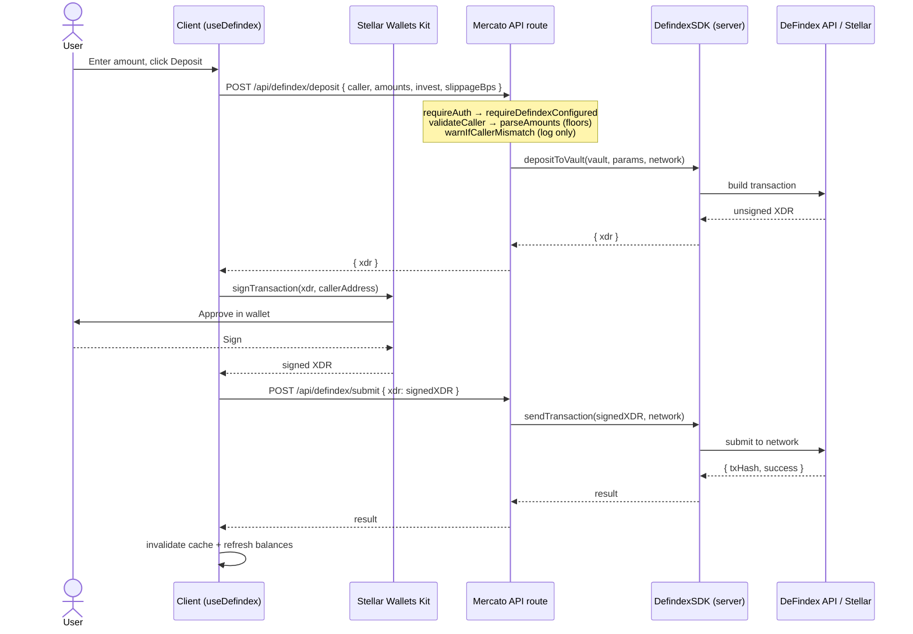

# DeFindex Vault Integration

Mercato lets users deposit into and withdraw from a shared [DeFindex](https://www.defindex.io/)
yield vault on Stellar/Soroban. DeFindex is a non-custodial vault protocol: Mercato never
holds user funds or signs on a user's behalf. The server only ever **builds unsigned
transactions**; the user's own wallet signs them, and the signed transaction is submitted
back through DeFindex.

This document describes how the integration is wired after the refactor tracked in
[issue #124](https://github.com/mercato-supply-chain/mercato-dapp/issues/124).

## End-to-end signing flow

Every state-changing vault action (deposit, withdraw, withdraw-by-shares, admin
create-vault / deposit / rebalance) follows the same three steps:

1. **Build** — the client `POST`s the raw parameters to a Mercato API route. The route
   authenticates the session, validates input, calls the DeFindex SDK, and returns an
   **unsigned XDR** transaction.
2. **Sign** — the client signs the XDR with the connected wallet via the
   [Stellar Wallets Kit](https://github.com/Creit-Tech/Stellar-Wallets-Kit)
   (`lib/trustless/wallet-kit.ts#signTransaction`). Signing happens entirely in the
   browser; the private key never leaves the wallet.
3. **Submit** — the client `POST`s the signed XDR to `/api/defindex/submit`, which relays
   it to the Stellar network through the DeFindex SDK (`sendTransaction`) and returns the
   transaction hash / result.

Read queries (`balance`, `vault`, `admin/monitor`) skip the sign/submit steps — they call
the SDK and return data directly.



The client orchestration lives in `hooks/useDefindex.ts` (`defaultDeposit`,
`defaultWithdraw`, `defaultWithdrawShares`, and the shared `signAndSubmit`). Withdraw and
admin flows are identical in shape — only the route and request body differ.

## Configuration & env-var contract

All env resolution has two homes so it is safe on both the server and the client:

- **`lib/defindex/client-config.ts`** — client-safe (does **not** import `@defindex/sdk`).
  Single source for public values shared by the server config, the client cache, and the
  pure amount helpers.
  - `getDefindexAssetDecimals()` → `NEXT_PUBLIC_DEFINDEX_ASSET_DECIMALS` (default `7`).
  - `getClientVaultContractId()` → `NEXT_PUBLIC_MERCATO_DEFINDEX_VAULT_ADDRESS` →
    `NEXT_PUBLIC_DEFINDEX_VAULT_ADDRESS`.
  - `hasClientVaultConfigured()` → whether a public vault id exists.
- **`lib/defindex/config.ts`** — server config (imports the SDK for `SupportedNetworks`).
  Re-exports `getDefindexAssetDecimals` and layers the server-only var on top of the client
  fallback chain.

| Variable | Scope | Purpose |
| --- | --- | --- |
| `MERCATO_DEFINDEX_VAULT_ADDRESS` | server | Preferred vault contract id (`C…`). |
| `NEXT_PUBLIC_MERCATO_DEFINDEX_VAULT_ADDRESS` | public | Client-visible vault id (fallback). |
| `NEXT_PUBLIC_DEFINDEX_VAULT_ADDRESS` | public | Legacy client-visible vault id (last fallback). |
| `DEFINDEX_API_KEY` | server | DeFindex API key (used to build/submit). |
| `NEXT_PUBLIC_DEFINDEX_API_KEY` | public | Backward-compat fallback for the key (avoid in prod). |
| `DEFINDEX_API_URL` / `NEXT_PUBLIC_DEFINDEX_API_URL` | server/public | Optional API base URL override. |
| `NEXT_PUBLIC_DEFINDEX_ASSET_DECIMALS` | public | Decimals for raw↔display conversion (default `7`). |
| `NEXT_PUBLIC_TRUSTLESS_NETWORK` | public | `mainnet` selects mainnet, otherwise testnet. |

`getMercatoVaultContractId()` resolves `MERCATO_DEFINDEX_VAULT_ADDRESS` first, then the
public fallbacks. `isDefindexConfigured()` needs both a vault id and an API key;
`isDefindexApiConfigured()` needs only the key (used by `submit` and every admin route,
which can operate before an env vault id exists).

## API routes

### User-facing (`requireAuth`)

| Route | Method | Purpose |
| --- | --- | --- |
| `/api/defindex/vault` | GET | Vault metadata, APY, totals, per-asset rows. |
| `/api/defindex/balance` | GET | The caller's position (dfTokens + underlying). |
| `/api/defindex/deposit` | POST | Build unsigned deposit XDR. |
| `/api/defindex/withdraw` | POST | Build unsigned withdraw-by-amounts XDR. |
| `/api/defindex/withdraw-shares` | POST | Build unsigned withdraw-by-shares XDR. |
| `/api/defindex/submit` | POST | Submit a signed XDR (API key only). |

### Admin-only (`requireAdmin` → `profiles.user_type === 'admin'`)

| Route | Method | Purpose |
| --- | --- | --- |
| `/api/defindex/admin/create-vault` | POST | Build unsigned vault-deployment XDR. |
| `/api/defindex/admin/deposit` | POST | Build unsigned deposit XDR (optional vault override, enforces the 1001-stroop init minimum). |
| `/api/defindex/admin/rebalance` | POST | Build unsigned rebalance XDR (Invest/Unwind). |
| `/api/defindex/admin/monitor` | GET | Full vault health snapshot + alerts (polled by the admin UI). |

## Shared helpers (post-refactor)

Concerns that used to be copy-pasted across routes and modules each now live in exactly
one place:

- **`lib/defindex/amounts.ts`** — the single canonical raw↔display converters
  (`rawToDisplayAmount`, `displayToRawAmount`), plus `sumUnderlyingDisplayAmounts` and
  vault-balance payload parsing. Decimals default to `getDefindexAssetDecimals()`.
- **`lib/defindex/route-helpers.ts`** — request-handling middleware:
  - `requireDefindexConfigured()` / `requireDefindexApiConfigured()` — config guards
    (503 unconfigured, 500 malformed vault id).
  - `validateCaller()` — Stellar-account validation (400).
  - `parseAmounts()` — non-empty positive array; **always floors** raw units (unifying the
    old floor-vs-no-floor split between admin and user deposit routes).
  - `resolveSlippageBps()` — defaults to 100 bps (1%).
  - `defindexErrorResponse()` — maps SDK errors to a status (validation → 400, rate limit →
    429, not-found → 404, everything else → 502) and logs server-side for triage.
  - `warnIfCallerMismatch()` — the soft caller check (see below).
- **`lib/defindex/create-vault-validation.ts`** — deep validation of create-vault payloads.
- **`lib/defindex/vault-monitor.ts`** — `resolveMonitorVaultAddress`, `buildVaultMonitorAlerts`,
  `buildVaultMonitorPayload` (health snapshot shared by `/vault` and `/admin/monitor`).
- **`lib/defindex/server-sdk.ts`** — the cached server SDK singleton, with
  `resetServerDefindexSdk()` for recovery/testing.

### Two error extractors, on purpose

- `api-error.ts#defindexErrorMessage(error)` — server side, extracts a message from a
  **caught SDK exception**.
- `vault-cache.ts#readErrorMessage(response)` — client side, extracts a message from a
  **failed `fetch` Response** (our routes' `{ error }` JSON body).

They handle different inputs, so they stay separate. The client hooks all import the single
`readErrorMessage`; there is no duplicate copy.

## Known limitations & decisions

### caller binding (soft, not enforced)

User-facing routes accept `caller` from the request body and require only that it is a
valid Stellar account — they do **not** hard-enforce that it matches the authenticated
session's wallet.

This is intentional. Building an XDR for an arbitrary `caller` is inert: the resulting
transaction still requires **that caller's own signature** to execute, which the requester
does not have. Hard enforcement was also rejected because `profiles.stellar_public_key` is
synced best-effort from the client, so a not-yet-synced profile would break legitimate
deposits.

The chosen middle ground (`warnIfCallerMismatch`) logs a `console.warn` when the requested
`caller` differs from the known wallet, giving observability without blocking. A missing
`stellar_public_key` is treated as "unknown", never a mismatch.

### Error observability

`defindexErrorResponse` logs every failed SDK call as `[defindex:<route>] request failed
(<status>)`. There is no external alerting sink yet — production triage relies on these
server logs and the admin monitor's alert panel.

### Amount precision

Raw amounts are integer stroops. `parseAmounts` floors defensively, and client converters
(`displayToRawAmount`) round, so fractional raw values never reach the SDK. Display
conversion uses `NEXT_PUBLIC_DEFINDEX_ASSET_DECIMALS` (default 7, matching USDC/XLM on
Stellar).

## Testing

Pure helpers are covered by `bun test` under `__tests__/defindex/`: amount math, route
helpers (status mapping, slippage, amounts/caller parsing), create-vault validation,
address validators, vault-position ownership math, extract-vault-address resolution, and
vault-monitor address resolution + alert building.

```bash
bun test __tests__/defindex/
```
